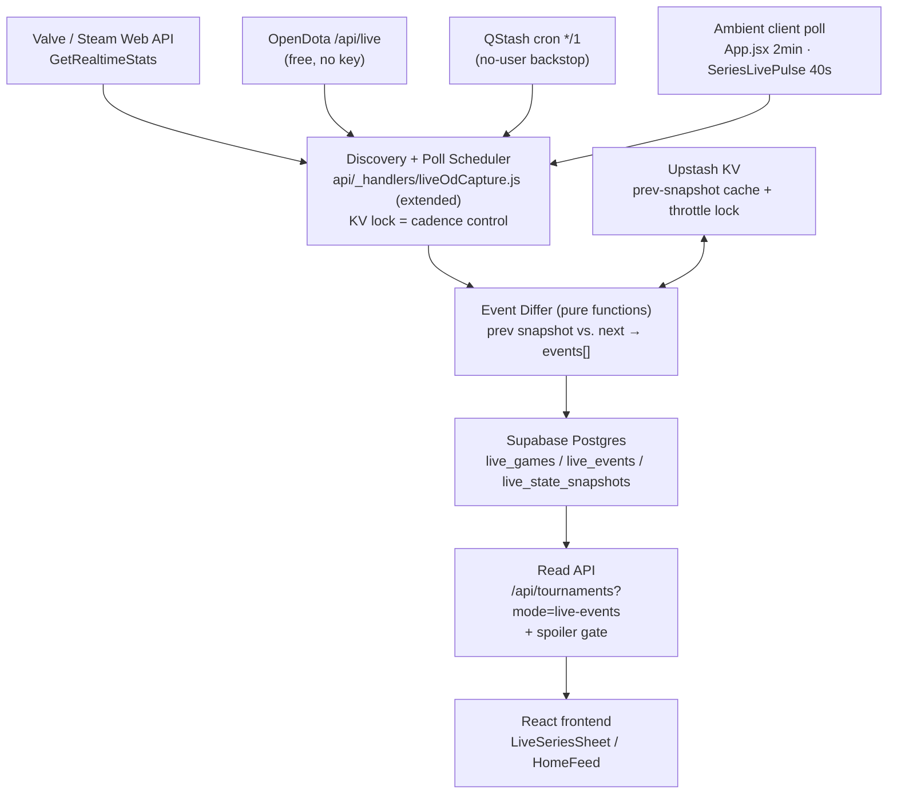
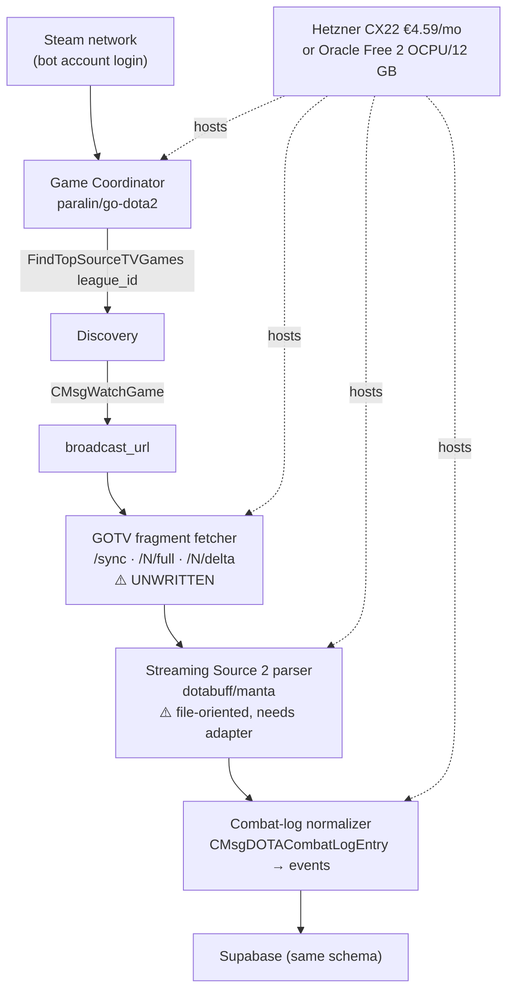

# Own Live Event Ingestion — Technical Investigation

**Date:** 2026-08-04
**Status:** Investigation only. No code written. Decision required before any implementation.
**Scope:** Can Spectate Esports build its own Dota 2 live event pipeline at ~$0/month instead of paying commercial providers?

---

## 0. Two corrections to the brief, up front

**(a) The stack is Vite + React, not Next.js.** `package.json` has `vite@7`, `react@19`, no `next`. The API layer is Vercel serverless functions under `/api/*` (plain `(req, res)` handlers), not Next.js API Routes. This doesn't change the architecture below — the ingestion worker is external to Vercel either way — but it matters for anyone reading the brief later.

**(b) "Replace PandaScore" and "build a live event pipeline" are two different projects.** This is the most important finding in the document, so it goes first.

I enumerated every PandaScore call site in the repo (33 files). Every single one is **schedule, structure, or identity** data:

| What PandaScore is used for today | Endpoints |
|---|---|
| Tournament/league discovery, tiers, brackets, standings | `/tournaments/{running,upcoming,past}`, `/series/*` |
| Match schedule (`scheduled_at`, `begin_at`) | `/matches/upcoming`, `/matches/running`, `/matches/past` |
| Series structure — Bo1/Bo3/Bo5, per-game results, series score | `match.games[]`, `number_of_games` |
| Team identity, slugs, acronyms, logos | `/teams` |
| **Official Twitch stream URLs** (the VOD system's anchor) | `match.streams_list` — **LOCKED subsystem** |

PandaScore supplies **zero in-game telemetry**. Not one kill, item, or tower. The live telemetry the app already shows — gold lead, kill score, live draft, hero picks, building state — comes from **OpenDota `/api/live`**, free, no key ([api/_handlers/liveOdCapture.js](api/_handlers/liveOdCapture.js#L45)).

So:

- **Replacing PandaScore** = replacing a schedule/metadata/streams backbone. Game Coordinator, GOTV, and replay parsers give you **none of that**. The realistic replacement is Liquipedia + Valve's league APIs, and it is a *harder, lower-value* project than it sounds (§9.1).
- **Building live event ingestion** (`HeroKilled`, `RoshanKilled`, `TowerDestroyed`, …) = a **net-new capability** that PandaScore never sold you. This is the interesting project, and it has a much cheaper answer than the brief assumes.

The rest of this document answers the brief's questions in full, but the recommendation splits along that line.

---

## 1. Executive Summary

**Is it possible?** Yes for live events — and cheaper than expected. Partially and unattractively for schedule data.

**The headline finding:** there is a **free, official, first-party Valve HTTP API** that returns nearly everything the brief asks for, and the codebase is already one field away from using it.

`GET https://api.steampowered.com/IDOTA2MatchStats_570/GetRealtimeStats/v1/?key={STEAM_API_KEY}&server_steam_id={id}` returns, for any live match:

```
match:     server_steam_id, match_id, game_time, game_state, league_id, league_node_id
teams[]:   team_number, team_id, team_name, team_tag, score, net_worth
  players[]: accountid, name, heroid, level,
             kill_count, death_count, assists_count, denies_count, lh_count,
             gold, net_worth,
             x, y,               ← live hero positions
             abilities[],        ← full learned-ability list
             items[]             ← full inventory
buildings[]: team, type, lane, tier, x, y, destroyed   ← every tower/rax individually
graph_data: graph_gold[]                                ← gold-advantage timeline
```

That is hero positions, inventories, ability levels, per-player KDA/CS/gold, and per-building destruction state — the exact list the brief hoped to get from the Game Coordinator or a replay parser. It costs a free Steam Web API key and an HTTP GET.

The missing link — `server_steam_id` — is **already being captured and stored** in `live_game_map.server_steam_id` by [liveOdCapture.js:100](api/_handlers/liveOdCapture.js#L100). (`GetLiveLeagueGames` notably does *not* return `server_steam_id`, which is why most projects that try this path fail; OpenDota `/api/live` does, and you already read it.)

**Therefore:** a diffing engine over `GetRealtimeStats` snapshots synthesizes ~80% of the requested event model at **$0 marginal infrastructure cost**, with **no ToS gray area**, **no Steam bot accounts**, **no protobuf parsing**, and **no new server**. It can even run as a QStash-triggered Vercel function alongside the existing capture.

The heavier paths (GC + GOTV broadcast + `manta`) buy you the remaining ~20% — smoke, runes, buybacks, exact kill attribution, sub-second timing — for roughly 100× the engineering and operational cost. **Do not start there.**

**Recommended path:** ship the `GetRealtimeStats` differ (Tier 1). Treat GC/GOTV as a *possible* Tier 3 that must be justified by a product need Tier 1 demonstrably cannot serve.

**The one thing that could kill the whole feature** is not technical: **DotaTV data runs ahead of the Twitch broadcast.** OpenDota `/api/live` reports `delay: 120` (2 min) on pubs; tournament organizers add up to 15 more minutes under Valve's DotaTV License. A live event feed built on this data will **spoil the stream your users are watching**. This must be designed for on day one (§6.6, §11) — it interacts directly with the existing Spoiler-Free Mode.

---

## 2. Data Source Investigation

### 2.A Steam Game Coordinator

**How authentication works.** You log a real Steam account into the Steam network (username/password, or a stored refresh token), call `gamesPlayed([570])` to signal you're "playing Dota 2", and the client is handed a GC session. All GC messages are protobuf over the Steam connection. There is no API key, no OAuth — it is a **full user account acting as a game client**.

**Existing libraries** (verified against the GitHub API, 2026-08-04):

| Repo | Lang | Stars | Last push | State |
|---|---|---|---|---|
| [paralin/go-dota2](https://github.com/paralin/go-dota2) | Go | 176 | **2026-08-04** | **Actively maintained.** Codegen'd from Valve's protos via `apigen`. The reference implementation. |
| [SteamRE/SteamKit](https://github.com/SteamRE/SteamKit) | C# | 3,156 | 2026-08-01 | Very active. The Steam-protocol foundation everything else copies. |
| [DoctorMcKay/node-steam-user](https://github.com/DoctorMcKay/node-steam-user) | JS | 1,108 | 2025-12-04 | Maintained. Steam session layer for Node. |
| [blastorg/gamecoordinator-dota-communicator](https://github.com/blastorg/gamecoordinator-dota-communicator) | TS | 12 | 2025-04-03 | **BLAST's own Dota GC client, open-sourced.** Thin, typed, sits on `node-steam-user`. Small but proof a Tier-1 esports company uses exactly this approach. |
| [ValvePython/dota2](https://github.com/ValvePython/dota2) | Python | 221 | 2023-03-02 | Stale (3 years). Usable as reference, not as a dependency. |
| [Arcana/node-dota2](https://github.com/Arcana/node-dota2) | JS | 552 | 2022-06-08 | **Archived.** Its own README points at `paralin/go-dota2`. Do not use. |

**Available event types / what it exposes.** From [`dota_gcmessages_client_watch.proto`](https://github.com/SteamTracking/GameTracking-Dota2/blob/master/Protobufs/dota_gcmessages_client_watch.proto):

- `CMsgClientToGCFindTopSourceTVGames` → `CMsgGCToClientFindTopSourceTVGamesResponse{ game_list: CSourceTVGameSmall[] }`. **Accepts a `league_id` filter.** Each `CSourceTVGameSmall` is field-for-field identical to what OpenDota `/api/live` returns — because that's exactly where OpenDota gets it. You would be reimplementing OpenDota's retriever.
- `CMsgWatchGame{ server_steamid, watch_server_steamid, client_version, regions }` → `CMsgWatchGameResponse{ watch_game_result, source_tv_public_addr, source_tv_port, watch_tv_unique_secret_code, broadcast_url }`. **`broadcast_url` is the gateway to the live GOTV stream** (§2.B).
- `CMsgClientToGCTopLeagueMatchesRequest`, `CMsgDOTASeries` (series structure + live game!), `CDOTABroadcasterInfo`, `CMsgClientToGCMatchesMinimalRequest`.

**Can it receive live updates?** Only by polling `FindTopSourceTVGames`. The GC does not push per-game telemetry. It is a **discovery and handshake layer**, not a telemetry feed.

**Hero positions?** No. **Inventories?** No. `CSourceTVGameSmall.players[]` is `{account_id, hero_id, team_slot, team}` — that's it. Positions and items require the GOTV stream (§2.B) or `GetRealtimeStats` (§2.E).

**Multiple matches?** Yes for discovery — one response carries up to ~100 games. But `CMsgWatchGame` is a per-game handshake, and `CMsgCancelWatchGame` exists, implying the client is expected to watch one at a time. N concurrent matches likely needs **N Steam accounts**, or at least careful sequencing.

**Production-ready?** The libraries are. The *approach* carries account risk (§10) and requires you to run and babysit logged-in Steam sessions.

**Blocking constraint found:** `CMsgWatchGameResponse.WatchGameResult` includes `MISSINGLEAGUESUBSCRIPTION`. Ticketed leagues require the bot account to own the league ticket. TI and most majors are free-to-spectate, but this is a per-event unknown, not a solved problem.

---

### 2.B SourceTV / GOTV

**Can pro matches be consumed live?** Yes, in principle. `CMsgWatchGameResponse.broadcast_url` is a Source 2 HTTP broadcast endpoint — the same mechanism CS2's `tv_broadcast` uses, documented on the [Valve wiki for CS:GO Broadcast](https://developer.valvesoftware.com/wiki/Counter-Strike:_Global_Offensive_Broadcast). The shape is `/sync` → current fragment number, then `/{n}/full` (keyframe) and `/{n}/delta` (incremental), ~3s per fragment.

**How the stream is obtained.** GC login → `FindTopSourceTVGames` (filter by `league_id`) → `CMsgWatchGame(server_steamid)` → poll `broadcast_url`. There is **no way to get `broadcast_url` without a GC session** — the Steam Web API does not expose it. This is why GOTV and GC are one project, not two.

**Can events be parsed before the match finishes?** Yes. Fragments carry `CDemoPacket`-class data — the same protobuf envelope as a `.dem` file. A streaming parser fed fragments in order produces live entity state and `CMsgDOTACombatLogEntry` events (kills, denies, purchases, Roshan, buybacks, runes, ability use). This is the **only** source in this document with true full-fidelity event data.

**Existing parsers.** See §2.D. All of them are written for a seekable `.dem` file, not a fragment stream. Adapting one to consume `/full` + `/delta` is real work and **nobody has published it for Dota 2**.

**Limitations — and this is the decisive one.** I searched GitHub code and the web specifically for a working Dota 2 live-broadcast consumer:

- `gh api search/code` for `dota broadcast_url WatchGame` → 20 hits, **every one is a copy of the `.proto` file**. Zero implementations.
- The only working `tv_broadcast` implementations ([FlowingSPDG/gotv-plus-go](https://github.com/FlowingSPDG/gotv-plus-go), [FIVESCUP/csgo-broadcast](https://github.com/FIVESCUP/csgo-broadcast)) are **CS:GO/CS2 relay servers**, not Dota consumers.

**You would be the first public implementation.** That is a research project with an unknown completion date, not an engineering task with an estimate.

Other limits: fragments are gone once the broadcast ends (no backfill); one `broadcast_url` per game; the broadcast carries the tournament delay baked in; the demo format changes with major patches.

---

### 2.C Running spectator clients

**Can a headless Dota client run on Linux?** Technically yes, practically no for this purpose. Dota 2 is Source 2 and requires a Vulkan device. You can force it under `Xvfb` + `llvmpipe` (software rasterization), which is what ML research harnesses like [TimZaman/dotaservice](https://github.com/TimZaman/dotaservice) (130★, last push 2024-02-18, **stale**) do. There is no `-headless`/`-textmode` equivalent for the Dota client.

**Resources per client (software rendering, realistic):**

| | Per spectator client |
|---|---|
| CPU | 1.0–2.0 cores sustained (llvmpipe rasterizes every frame) |
| RAM | 2.5–4 GB |
| GPU | None *required*, but without one CPU cost roughly triples |
| Startup | 30–90s (launch → GC → connect → spectate) |
| Disk | ~50 GB game install, plus per-instance prefix |

**Max simultaneous matches on free-tier hardware:** Oracle Always Free is now **2 OCPU / 12 GB** (halved 2026-06-15, see §3). That is **one** spectator client, maybe. On a Hetzner CX22 (2 vCPU / 4 GB, €4.59/mo): **zero** — it can't even hold one.

**Stability:** poor. Game updates force client updates; a mid-tournament Valve patch breaks every running client until you re-download and restart. Crashes are common under llvmpipe.

**Existing projects:** `dotaservice` (stale), `Nostrademous/Dota2-FullOverwrite` (2017, bot scripting, irrelevant). Nothing maintained, nothing production.

**Verdict: rejected.** Highest cost, highest ToS risk (automating the game client), worst stability, and it produces the *same* data as the GOTV path at ~30× the resource cost. There is no scenario where this is the right answer.

---

### 2.D Open-source parsers

Verified against the GitHub API on 2026-08-04:

| Repo | Lang | ★ | Last push | Verdict |
|---|---|---|---|---|
| [dotabuff/manta](https://github.com/dotabuff/manta) | Go | 684 | 2026-07-01 | **Best choice.** Source 2 parser, Dotabuff-maintained, event-callback API, ships current Dota protos. Go = single static binary, ideal for a tiny VPS. |
| [skadistats/clarity](https://github.com/skadistats/clarity) | Java | 756 | 2026-07-22 | Fastest (2–5× smoke). Active. JVM RAM/ops overhead is a real cost at this budget. |
| [odota/parser](https://github.com/odota/parser) | Java | 159 | 2026-08-01 | **Very active.** Clarity wrapper that already emits OpenDota's event schema — closest thing to a reference event model. |
| [Rupas1k/source2-demo](https://github.com/Rupas1k/source2-demo) | Rust | 64 | 2026-07-07 | Active, clean observer API. Smaller community; fewer people to ask when a patch breaks it. |
| [timkurvers/redota](https://github.com/timkurvers/redota) | JS | 91 | 2026-07-31 | Active. Browser replay *viewer*. Useful to read for wire-format understanding, not as a backend dep. |
| [dotabuff/d2vpkr](https://github.com/dotabuff/d2vpkr) | Go | 183 | 2026-08-03 | Not a parser — VPK/game-data extraction. Useful for item/ability id maps. |
| [odota/rapier](https://github.com/odota/rapier) | JS | 44 | 2017-10-21 | **Dead.** |
| [skadistats/smoke](https://github.com/skadistats/smoke) | Python | 205 | 2015-03-28 | **Archived.** |
| [ValvePython/dota2](https://github.com/ValvePython/dota2) | Python | 221 | 2023-03-02 | Stale. |

**Language preference ranking for this project:** Go (`manta`) > Rust (`source2-demo`) > Java (`clarity`/`odota-parser`) > Python (nothing maintained) > TypeScript (nothing maintained).

**Critical caveat:** every one of these parses a **complete `.dem` file**. None consume a live fragment stream. That adapter is the unwritten piece (§2.B).

---

### 2.E Steam Web API — the path the brief didn't consider

Two free, official, first-party endpoints. Both need a Steam Web API key (free, one per Steam account, obtained from `steamcommunity.com/dev/apikey`).

**`IDOTA2MatchStats_570/GetRealtimeStats/v1`** — the important one. Schema confirmed against two independent implementations ([ybabts/steamy](https://github.com/ybabts/steamy/blob/main/src/Dota2/api/getRealtimeStats.ts), [HouPoc/DOTA2_VisLive](https://github.com/HouPoc/DOTA2_VisLive/blob/master/doc/API.md)) and reproduced in §1.

**`IDOTA2Match_570/GetLiveLeagueGames/v1`** — live league games with scores and player stats, **but it does not return `server_steam_id`**, which makes it a dead end for feeding `GetRealtimeStats`. Use OpenDota `/api/live` instead (which does, and which you already call).

**Known behavior (from practitioner reports):** both endpoints carry latency — `GetRealtimeStats` reflects the DotaTV broadcast delay, not wall-clock game state. This is a spoiler mitigation as much as a limitation (§6.6).

**Hard limit:** the [Steam Web API Terms of Use](https://steamcommunity.com/dev/apiterms) cap usage at **100,000 calls per day per key**. This is the single binding constraint on the whole design (§4).

**Unverified:** I could not empirically test `GetRealtimeStats` — the repo has no `STEAM_API_KEY`, un-keyed probes return 403, and there are currently **zero live league games** in OpenDota `/api/live` (all 100 entries are `league_id: 0` pubs). This is **Experiment 1** in §12 and must run before any code is written.

---

## 3. Infrastructure

Design principle: **Vercel keeps serving only frontend + API. Supabase stays the only datastore. Ingestion is a single stateless worker.**

| Option | Spec | Cost/mo | Verdict for this project |
|---|---|---|---|
| **Vercel functions + QStash** (existing) | serverless | **$0** | ✅ **Sufficient for Tier 1.** Already how `od-live-capture` runs. Zero new infra. |
| **Oracle Cloud Always Free** | 2 OCPU ARM / 12 GB / 200 GB / 10 TB egress | **$0** | ⚠️ **Halved from 4/24 on 2026-06-15** ([InfoQ](https://www.infoq.com/news/2026/07/oracle-cloud-free-tier-limits/)). Chronic "Out of Capacity" in popular regions. Best free option for Tier 2/3, but not dependable. |
| **Hetzner CX22** | 2 vCPU / 4 GB / 40 GB / 20 TB | **€4.59** (~$5) | ✅ **Best paid option.** Fits the <$10 budget. Reliable, EU-based (low latency to most tournament GOTV relays). |
| **Fly.io** | 256 MB shared-cpu-1x | ~$2 floor, $8–25 real | ❌ Free tier removed. Per-second billing + egress makes cost unpredictable. |
| **Railway** | usage-based | $5 credit then metered | ❌ No flat tier. A always-on long-poll worker bills badly. |
| **Render** | free tier / 512 MB | $0 (sleeps) / $7 | ❌ **Free tier sleeps after 15 min idle.** Fatal for a continuous ingestion worker. |
| **DigitalOcean** | 1 vCPU / 1 GB | $6 | ⚠️ Works, strictly worse specs than Hetzner at higher price. |
| **GitHub Actions** | 2000 min/mo | $0 | ❌ **Already proven unreliable here** — memory: crons fire every 1.5–4h regardless of declared cadence. Moved off 2026-06-26. Do not revisit. |
| **Self-host (home)** | — | ~$0 + power | ❌ Residential IP, no SLA, single point of failure, you're on holiday during TI. |
| **Supabase** | 500 MB DB / 5 GB egress | **$0** → $25 Pro | ⚠️ **500 MB is the real ceiling** (§4). Free projects also pause after 7 days idle — irrelevant here given constant writes. |

**Recommendation by tier:**
- **Tier 1 (`GetRealtimeStats` differ):** Vercel + QStash + Supabase. **$0/mo, no new infrastructure.**
- **Tier 2/3 (GC + GOTV + manta):** Hetzner CX22 at ~$5/mo. Oracle Free as a $0 alternative if you can get capacity, but assume you'll fall back to Hetzner.

---

## 4. Scalability

### 4.1 The binding constraint

Steam Web API: **100,000 calls/day**. Everything else has orders of magnitude of headroom.

```
calls_per_game = game_duration_seconds / poll_interval_seconds
```

A 40-minute game at 5s = 480 calls. At 10s = 240.

| Concurrent live games | Poll interval | Calls/day (8h active window) | Under 100k? |
|---|---|---|---|
| 1 | 5s | 5,760 | ✅ 6% |
| 5 | 5s | 28,800 | ✅ 29% |
| 20 | 5s | 115,200 | ❌ 115% |
| 20 | 10s | 57,600 | ✅ 58% |
| 50 | 10s | 144,000 | ❌ 144% |
| 50 | 20s | 72,000 | ✅ 72% |

**Adaptive cadence is mandatory, not optional.** Rule: `interval = clamp(5s, ceil(N_live / 4) × 5s, 30s)`.

**Reality check:** tier-1 Dota peaks at ~8 concurrent games (TI group stage, four streams × two). Memory (`project_live_feed_concurrency`) measured simultaneous tier-1 live rows at just **26% of live time, 5% on ordinary events**. The 20/50-match rows are stress scenarios, not the operating point. At the real operating point, **5s polling on every live tier-1 game fits in ~30% of the daily quota.**

### 4.2 Resource envelope — Tier 1 (`GetRealtimeStats` differ)

Payload ~15 KB/response (10 players × items+abilities arrays, ~30 buildings, growing `graph_gold`).

| | 1 game | 5 games | 20 games | 50 games |
|---|---|---|---|---|
| CPU | negligible — JSON diff | " | " | ~0.1 core |
| RAM | ~30 MB (prev-snapshot cache: 10 games × ~200 KB) | 30 MB | 50 MB | 100 MB |
| Network in | 3 MB/min | 15 MB/min | 60 MB/min* | 90 MB/min* |
| Storage | see §4.4 | | | |

\* at adapted (slower) cadence

Fits inside a Vercel serverless function's default limits with enormous headroom.

### 4.3 Resource envelope — Tier 3 (GOTV + manta), for comparison

| | 1 game | 5 games | 20 games | 50 games |
|---|---|---|---|---|
| CPU | 0.1–0.3 core | 0.5–1.5 | 2–6 | 5–15 |
| RAM | 150–300 MB (full entity state) | 0.8–1.5 GB | 3–6 GB | 8–15 GB |
| Bandwidth | ~25 KB/s | 125 KB/s | 500 KB/s (~1.8 GB/h) | 1.2 MB/s |
| Steam accounts | 1 | likely 5 | likely 20 | likely 50 |

**Oracle Free (2 OCPU / 12 GB) caps out around 8–12 concurrent games.** Hetzner CX22 (2 vCPU / 4 GB) caps out around **5**. The 50-game row needs a ~$40/mo machine and 50 Steam accounts — well outside budget and well inside ban risk.

### 4.4 Database writes and the Supabase ceiling

Estimated derived events per 40-minute pro game:

| Event | Count/game | Source |
|---|---|---|
| `AbilityLearned` | ~250 | `abilities[]` diff |
| `ItemPurchased` | ~150 | `items[]` diff (net of consumable churn) |
| `HeroLevelUp` | ~250 | `level` diff |
| `HeroKilled` | ~60 | `kill_count`/`death_count` diff |
| `TowerDestroyed` / `BarracksDestroyed` | ~15 | `buildings[].destroyed` transition |
| `AegisPickedUp` / `RoshanKilled` | ~8 | aegis item id in `items[]` |
| `NetWorthSnapshot` (downsampled 30s) | ~80 | throttled |
| **Total** | **~800 rows** | |

At ~120 bytes/row plus indexes → **~200 KB/game**.

| Scenario | Games/day | Storage/day | Storage/month |
|---|---|---|---|
| Tier-1 only, event days | 20 | 4 MB | ~60 MB (15 event days) |
| All league games, every day | 60 | 12 MB | **360 MB** |

**Supabase free tier is 500 MB total, and `live_game_map` / `live_game_gold` / `match_stream_history` already occupy some of it.** Ingesting every league game fills the free tier in ~6 weeks.

**Mitigations, in order of preference:**
1. **Tier-1 filter at ingest.** Only ingest games matching a tier-1 PandaScore/OpenDota league. This is already the site's operating rule and cuts volume ~4×.
2. **90-day retention** via `pg_cron` (`DELETE FROM live_events WHERE ts < now() - interval '90 days'`). Or 30 days if space gets tight.
3. **Don't store raw snapshots.** Store *derived events* + a downsampled net-worth series. Storing every 5s snapshot × 10 players would be ~5,400 rows/game and blows the budget immediately.
4. Supabase Pro ($25/mo) is the escape hatch — but that's 5× the entire infra budget, so treat it as a failure mode, not a plan.

---

## 5. Reliability

### 5.1 How often Valve changes protocols — measured, not guessed

From the commit history of [SteamTracking/GameTracking-Dota2](https://github.com/SteamTracking/GameTracking-Dota2):

| Surface | Change rate | Risk |
|---|---|---|
| `Protobufs/` overall | **3–5 commits/month**, steady since 2024 | Medium |
| `dota_gcmessages_client_watch.proto` (the file GC/GOTV depends on) | 2025-06-13, 2025-05-22, 2025-03-21, then nothing. **3 changes in 2025, 0 so far in 2026.** | **Low** |
| Replay/demo entity format | tracks major patches; `manta` sees 1–2 commits/month | Medium |
| Steam Web API JSON (`GetRealtimeStats`) | **No documented breaking change in years.** Undocumented but stable. | **Low** |

**Implication:** protocol churn is *not* the main GC/GOTV risk. The main risks are account bans and the unwritten fragment-stream adapter.

### 5.2 Failure modes and recovery

| Failure | Detection | Recovery | Tier affected |
|---|---|---|---|
| Steam Web API 403/401 | HTTP status | Alert + fail-open (feed goes stale, site keeps working) | 1 |
| Steam Web API 429 / quota exhausted | HTTP status + call counter | Widen poll interval; shed non-tier-1 games first | 1 |
| `server_steam_id` missing from OD `/api/live` | null check at capture | Skip that game; retry next tick | 1 |
| OpenDota `/api/live` down | fetch fails | Existing code already fails open ([liveOdCapture.js:163](api/_handlers/liveOdCapture.js#L163)) | 1 |
| Game ends mid-poll | `game_state` transition / 404 | Emit `GameEnded`, drop from poll set | 1 |
| Supabase write fails | PostgREST error | Existing pattern: log + continue, never break the read path | 1 |
| Steam account VAC/community ban | GC login fails | Rotate to spare account. **No appeal path.** | 2/3 |
| GC session drop | heartbeat timeout | Exponential-backoff relogin (30s → 5min cap) | 2/3 |
| `MISSINGLEAGUESUBSCRIPTION` | `WatchGameResult` enum | Skip that league entirely; no workaround without buying the ticket | 2/3 |
| GOTV fragment gap | non-contiguous fragment number | Re-fetch `/{n}/full` keyframe and resync | 3 |
| Valve patch breaks `manta` | parser exception storm | Pin parser version; wait for upstream fix (historically days) | 3 |

### 5.3 Match discovery

Unchanged from today: OpenDota `/api/live` → filter `league_id > 0` and both team names present → correlate to a PandaScore series via `findOdMatchByTime()` in [_shared.js](api/_shared.js). This logic is already written, already tested, and already handles the false-match hazard that bit on 2026-07-31. **Reuse it. Do not write a second correlation path** (see `feedback_ps_od_matching`, `feedback_reuse_existing_logic`).

### 5.4 Required monitoring

Must be **in-app only** — Vercel is on the free plan, so Log Drains are unavailable (`project_vercel_plan`).

- Steam Web API daily call counter in KV, exposed on the existing `?mode=monitor` endpoint. Alert at 70% of 100k.
- Per-game "last successful poll" age; alert if a game is live and unpolled >60s.
- Event-emission rate sanity check: a live game emitting **zero** events for 5 minutes means the differ is broken, not that the game is quiet.
- Existing `trackError()` for all failures.

---

## 6. Data Model (Supabase / Postgres)

### 6.1 Design principles

1. **One append-only event table**, not one table per event type. Event types are open-ended; migrations per new event type would be miserable.
2. **`(od_match_id, game_time, event_type, seq)` is the natural key.** `game_time` is the in-engine clock — stable, monotonic, and what every consumer wants on an x-axis. Wall-clock `captured_at` is metadata, not identity.
3. **Idempotent by construction.** The differ re-derives events from snapshots; a duplicate poll must be a no-op. Same `ON CONFLICT DO NOTHING` pattern as `live_game_gold`.
4. **JSONB payload for event-specific fields**, typed columns only for what is queried or joined. Avoids 12 sparse column sets.
5. **Store raw, filter at read** — the convention already established across `live_game_map` and `live_game_gold`.

### 6.2 Schema

```sql
-- Parent: one row per live game we are ingesting.
-- FK target for events. od_match_id is already the join key used across the codebase.
create table live_games (
  od_match_id      bigint primary key,
  server_steam_id  text        not null,        -- TEXT: exceeds bigint, same as live_game_map
  league_id        int,
  radiant_team_id  int,
  dire_team_id     int,
  radiant_name     text,
  dire_name        text,
  started_at       timestamptz not null default now(),
  ended_at         timestamptz,
  last_polled_at   timestamptz,
  last_game_time   int,                          -- resume point after a worker restart
  status           text        not null default 'live'
                     check (status in ('live','ended','abandoned'))
);
create index live_games_status_idx on live_games (status) where status = 'live';

-- Child: the event stream. Append-only.
create table live_events (
  id           bigserial   primary key,
  od_match_id  bigint      not null references live_games(od_match_id) on delete cascade,
  game_time    int         not null,             -- in-engine seconds; negative = draft/pre-horn
  event_type   text        not null,
  seq          smallint    not null default 0,   -- disambiguates same-type events in one tick
  team         smallint    check (team in (2,3)),-- Valve convention: 2=Radiant, 3=Dire
  player_slot  smallint    check (player_slot between 0 and 9),
  hero_id      int,
  target_slot  smallint    check (target_slot between 0 and 9),
  payload      jsonb       not null default '{}'::jsonb,
  captured_at  timestamptz not null default now(),
  confidence   text        not null default 'exact'
                 check (confidence in ('exact','inferred','uncertain')),

  constraint live_events_natural_key
    unique (od_match_id, game_time, event_type, player_slot, seq)
);

create index live_events_match_time_idx on live_events (od_match_id, game_time);
create index live_events_type_idx       on live_events (od_match_id, event_type);
create index live_events_recent_idx     on live_events (captured_at desc);
create index live_events_payload_gin    on live_events using gin (payload jsonb_path_ops);

-- Downsampled state timeseries. Separate from events: different write rate,
-- different read pattern, and it must not bloat the event index.
create table live_state_snapshots (
  od_match_id   bigint      not null references live_games(od_match_id) on delete cascade,
  game_time     int         not null,
  radiant_nw    int,
  dire_nw       int,
  radiant_score smallint,
  dire_score    smallint,
  radiant_towers smallint,
  dire_towers    smallint,
  captured_at   timestamptz not null default now(),
  primary key (od_match_id, game_time)
);
```

### 6.3 Event catalogue

`confidence` is a first-class column because roughly a third of these are **derived**, not observed. Never present an inferred event to a user as fact without saying so.

| `event_type` | Derivation from `GetRealtimeStats` | `payload` | Confidence |
|---|---|---|---|
| `HeroKilled` | `death_count` increments on victim; `kill_count` increments on a killer | `{killer_slot, assist_slots[]}` | **`exact`** for the death; `inferred` for killer when >1 kill in one tick |
| `ItemPurchased` | new id appears in `players[i].items[]` | `{item_id, slot}` | `exact` (but see §6.4) |
| `AbilityLearned` | new id in `players[i].abilities[]` | `{ability_id}` | `exact` |
| `HeroLevelUp` | `players[i].level` increments | `{level}` | `exact` |
| `TowerDestroyed` | `buildings[j].destroyed` false→true, `type` = tower | `{lane, tier}` | **`exact`** — includes exact lane and tier |
| `BarracksDestroyed` | same, `type` = barracks | `{lane, kind}` | `exact` |
| `AncientDestroyed` / `GameEnded` | `game_state` transition, or ancient building destroyed | `{winner}` | `exact` |
| `AegisPickedUp` | aegis item id appears in some `items[]` | `{hero_id}` | `exact` |
| `RoshanKilled` | **inferred** from `AegisPickedUp` (± cheese later in game) | `{killed_by_team, method:'aegis_inference'}` | **`inferred`** |
| `NetWorthSwing` | `teams[].net_worth` delta exceeds a threshold | `{delta, radiant_nw, dire_nw}` | `exact` |
| `Teamfight` | ≥3 `HeroKilled` within a 20s window | `{deaths[], net_worth_delta}` | `inferred` |
| `BuybackUsed` | gold drops by ≈buyback cost while hero is dead | `{cost_estimate}` | **`uncertain`** — do not ship without validation |
| `RunePickedUp` | ❌ **not derivable** | — | — |
| `SmokeUsed` | ❌ **not derivable** (smoke is a consumable; leaving inventory ≠ used) | — | — |
| `WardPlaced` | ❌ **not derivable** for the same reason | — | — |

The three ❌ rows require the GOTV combat log (Tier 3). They are the honest cost of the cheap path.

### 6.4 Known derivation hazards

- **`ItemPurchased` vs. inventory movement.** `items[]` is *current inventory*, not a purchase log. Moving an item to the backpack, selling, or a courier delivery all mutate it. Mitigation: only emit on **first-ever appearance** of an item id for that player in that match, and suppress the known consumable set (tango, clarity, salve, ward, smoke, dust) or mark them `inferred`.
- **Kill attribution under concurrency.** One tick with two deaths and two kill increments has an ambiguous pairing. Rule: emit both `HeroKilled` events with `confidence='inferred'` and `killer_slot=null` rather than guessing. A wrong killer is worse than an unattributed kill.
- **`radiant_lead` zero-snapshot bug already seen in prod.** [liveGamePulse.js:50](api/_handlers/liveGamePulse.js#L50) already filters bogus all-zero telemetry for OD `/live`. Assume `GetRealtimeStats` has the same class of transient. **Apply the same guard at write time, not read time,** for events — an event row is permanent in a way a graph point isn't.
- **`game_time` can go backwards or freeze** on pause. Never emit an event for a `game_time` ≤ the game's `last_game_time` unless the type genuinely allows it. The unique constraint catches the rest.

### 6.5 Indexing strategy

- `(od_match_id, game_time)` — the primary read: "give me this match's timeline."
- `(od_match_id, event_type)` — "how many towers has Radiant lost."
- `(captured_at desc)` — the cross-match "what just happened" homepage feed.
- GIN on `payload` with `jsonb_path_ops` — smaller and faster than default GIN for the containment queries this will actually run.
- **Do not** index `team`, `hero_id`, or `confidence` initially. Low cardinality, and index bloat is a direct hit on a 500 MB budget. Add them only when a real query needs one.

### 6.6 Spoiler handling belongs in the schema

Add to `live_games`:

```sql
alter table live_games add column broadcast_delay_s int not null default 120;
```

Every read path must be able to answer "would returning this event spoil the broadcast?" The client already has Spoiler-Free Mode; the API needs to serve it. Recommended rule: **never expose an event whose `game_time` is inside `broadcast_delay_s` of the newest observed `game_time` for that match**, unless the caller explicitly opts in.

---

## 7. Recommended Architecture

### 7.1 Tier 1 — recommended (no new infrastructure)



**Component by component:**

1. **OpenDota `/api/live`** — free, unauthenticated match discovery. Supplies `server_steam_id`, `league_id`, team names, `activate_time`. **Already integrated.**
2. **Steam Web API `GetRealtimeStats`** — per-match deep telemetry. New. Needs `STEAM_API_KEY` env var.
3. **Poll scheduler** — extends `captureOdLiveOnce()`. After the existing `live_game_map` upsert, take the tier-1-matched games and fan out `GetRealtimeStats` calls. Reuses the existing `LOCK_TTL_S` KV lock, which already guarantees at most one fetch cycle per interval regardless of caller count. **Adaptive interval based on live-game count and the daily call counter.**
4. **Event differ** — pure functions, `(prevSnapshot, nextSnapshot) → Event[]`. No I/O. Unit-testable against recorded fixtures, which matters enormously because you cannot summon a live TI game to debug against.
5. **KV snapshot cache** — previous snapshot per match, ~200 KB each, 10-minute TTL. Upstash Redis, already provisioned.
6. **Supabase** — `ON CONFLICT DO NOTHING` batch insert. Failure logs and continues; never breaks the read path.
7. **Read API** — a new `?mode=` on `api/tournaments.js`, matching the existing handler convention. Applies the spoiler gate.
8. **Frontend** — feeds the existing live sheet and homepage.
9. **Triggers** — the existing dual trigger: client ambient poll (free) + QStash `*/1` backstop for no-user windows.

**Why this shape:** every component except the differ and `GetRealtimeStats` already exists. There is no new server, no new datastore, no new deploy target, no new failure domain.

### 7.2 Tier 3 — the heavy path, for reference only



Same `live_events` schema downstream — which is the point. Tier 3, if it ever happens, is a **source swap behind a stable interface**, not a rewrite. Design Tier 1's normalizer boundary accordingly.

---

## 8. MVP

**The smallest thing that puts live pro match events on Spectate.**

**Ship exactly this. Nothing else.**

- **Scope:** *tier-1 live games only*, four event types: `TowerDestroyed`, `HeroKilled`, `RoshanKilled` (aegis-inferred), `ItemPurchased` (big items only — BKB, Blink, Aghanim's, Radiance, Rapier, Refresher, Octarine, Shiva's).
- **Why these four:** `TowerDestroyed` is `exact` and includes lane+tier (immediately better than the current `building_state` bitmask, which per `api/_buildingState.js` cannot even resolve barracks). `HeroKilled` is the most legible event to a viewer. `RoshanKilled` is the single highest-value moment in Dota and is **completely absent** from OpenDota `/api/live` (`project_live_telemetry_inventory`). Big-item purchases are the cheapest "something is about to happen" signal.
- **Cadence:** fixed 10s. No adaptive logic in the MVP.
- **UI:** one vertical event feed inside the existing `LiveSeriesSheet`, owner-gated (`?owner=1`) — the same staged-rollout pattern used for the gold graph and objectives readout.
- **Spoiler rule:** hard-suppress any event within 120s of the match's newest `game_time`. Not configurable in the MVP.
- **Infra:** none. Extends `liveOdCapture.js`.

**Explicitly NOT in the MVP:** hero position rendering, teamfight detection, buyback inference, ability tracking, level-up tracking, net-worth swing events, cross-match feeds, push notifications, adaptive cadence, GC, GOTV, replay parsing, any new server.

**Definition of done:** during one real tier-1 series, the feed shows correct towers, kills, and Roshan, with zero false positives, and the site's existing behavior is unchanged if the feed fails.

**Effort:** ~2 days for the differ + schema + endpoint, ~1 day for the UI, plus one live tournament for validation. Compare to Tier 3: weeks of research with no guarantee of success.

---

## 9. Cost Analysis

### 9.1 Infrastructure

| | MVP | 100 DAU | 1,000 DAU | 10,000 DAU |
|---|---|---|---|---|
| Vercel (frontend + API) | $0 | $0 | $0 | **$20** (Pro — bandwidth/invocations) |
| Supabase | $0 | $0 | $0–25 | **$25** (Pro — 500 MB will be exceeded) |
| Upstash Redis | $0 | $0 | $0 | $0–10 |
| Steam Web API | **$0** | $0 | $0 | $0 (server-side; DAU-independent) |
| OpenDota | $0 | $0 | $0 | $0 |
| QStash | $0 | $0 | $0 | $0–5 |
| Ingestion compute | **$0** (Tier 1) | $0 | $0 | $0 |
| **Tier 1 total** | **$0** | **$0** | **$0–25** | **~$50–60** |
| *Tier 3 add-on (Hetzner)* | *+$5* | *+$5* | *+$5* | *+$5* |

**Key property: ingestion cost is independent of DAU.** Polling load is driven by concurrent *matches*, not users. Read load scales with DAU and is absorbed by the existing KV cache layer. This is a genuinely favorable scaling shape.

**The real cost driver at scale is Supabase storage, not compute.** §4.4 shows the free 500 MB filling in ~6 weeks without a retention policy. **Ship the retention policy with the MVP, not after.**

### 9.2 AI costs (separate, as requested)

Current pricing (Anthropic first-party API):

| Model | Input $/MTok | Output $/MTok |
|---|---|---|
| Claude Haiku 4.5 (`claude-haiku-4-5`) | $1.00 | $5.00 |
| Claude Sonnet 5 (`claude-sonnet-5`) | $3.00 ($2.00 intro through 2026-08-31) | $15.00 ($10.00 intro) |

Discounts that apply: **cache reads ~0.1×** base input, cache writes 1.25× (5-min TTL) / 2× (1-hour); **Message Batches API = 50% off** all tokens. Batching is a natural fit for post-game narration; caching is a natural fit for a stable system prompt across many matches.

Live event narration is the obvious AI use case ("Roshan down, Team X takes aegis at 24:15"). Estimate at Haiku 4.5, ~800 input / ~120 output tokens per narration, ~40 narrations per game:

| | Games/mo | Cost/mo (no discounts) | With caching + batch |
|---|---|---|---|
| MVP (owner-only, no AI) | — | **$0** | $0 |
| Tier-1 events only | 300 | ~$0.30 | ~$0.10 |
| All league games | 1,800 | ~$1.80 | ~$0.60 |

**AI is a rounding error here.** The existing `/api/summarize.js` Haiku spend already dwarfs it. Do not let AI-cost concerns influence the ingestion architecture.

### 9.3 What replacing PandaScore would actually cost

For completeness, since it's the brief's framing. PandaScore's role is schedule + series structure + tournament metadata + **official stream URLs**.

- **Schedule/tournaments/brackets:** Liquipedia. But its [API Terms of Use](https://liquipedia.net/api-terms-of-use) restrict free LPDB access to "educational purposes, non-commercial public websites that do not monetize" — Enterprise otherwise. Spectate runs GA4, Vercel Analytics, and an editorial pipeline; whether that constitutes monetization is a call to make deliberately, not by default. Rate limit: 1 req/2s, 1 `action=parse`/30s. Attribution (CC-BY-SA 3.0) and a contact-bearing User-Agent are mandatory.
- **Series structure (Bo3/Bo5):** `CMsgDOTASeries` via GC gives `series_type` and per-game results. Requires the GC path.
- **Official stream URLs:** **no free replacement exists.** `CDOTABroadcasterInfo` gives broadcaster account ids, not Twitch channels. This alone means PandaScore cannot be fully removed without breaking the **LOCKED VOD Replay System**.

**Verdict: do not attempt to replace PandaScore.** The cost is a large rewrite across 33 files, a licensing question, a strictly worse data quality position, and a direct threat to the locked VOD subsystem — in exchange for saving a subscription that is buying something the alternatives don't sell.

---

## 10. Risks

| # | Risk | Level | Detail & mitigation |
|---|---|---|---|
| **T1** | `GetRealtimeStats` is undocumented and can be changed or removed by Valve without notice | **Medium** | No documented breaking change in years, but no SLA either. Mitigation: fail open (feed disappears, site unaffected); keep the OD `/live` pulse as the always-available floor. |
| **T2** | 100k/day Steam Web API cap | **Low** | Real operating point is ~30% of quota (§4). Mitigation: adaptive cadence + in-KV counter + alert at 70%. |
| **T3** | Derived events are wrong (kill attribution, item churn, buyback) | **Medium** | Directly damages trust — a wrong "Roshan down" is worse than no feed. Mitigation: `confidence` column; never ship `uncertain` events; validate against post-game OpenDota parsed data before going public. |
| **T4** | Supabase 500 MB exhausted | **Medium** | Mitigation: tier-1 filter + 90-day retention + no raw snapshots. Ship all three with the MVP. |
| **T5** | Broadcast delay unknown/variable per event | **Medium** | Mitigation: `broadcast_delay_s` per game, conservative 120s default, tunable per tournament. |
| **T6** | GOTV live fragment adapter does not exist publicly | **High** | Applies to Tier 3 only. **This is the single strongest argument for not starting there.** |
| **T7** | Steam account ban (GC/GOTV path) | **High** | Applies to Tier 2/3 only. Automation is prohibited under the Steam Subscriber Agreement (§L1). No appeal. Mitigation: don't take this path; if you must, use a dedicated throwaway account with no library/inventory value. |
| **T8** | Ticketed league gating (`MISSINGLEAGUESUBSCRIPTION`) | **Medium** | Tier 2/3 only. No technical workaround. |
| **T9** | Valve protocol change breaks parsing | **Low–Medium** | Watch proto changed 3× in 2025, 0× in 2026. Web API JSON more stable still. Mitigation: pin `manta`; monitor `SteamTracking/GameTracking-Dota2`. |
| **L1** | **Steam Subscriber Agreement prohibits automation** | **High (Tier 2/3) / Low (Tier 1)** | The SSA bars "scripts, bots, macros, or other non-human-controlled systems" interacting with Steam. A bot account logging into the GC is squarely within that. **The Steam Web API is a separate, explicitly-sanctioned surface** with its own [Terms of Use](https://steamcommunity.com/dev/apiterms) — Tier 1 is on the right side of this line, Tier 2/3 is not. |
| **L2** | Steam Web API ToU obligations | **Low** | Must: stay under 100k/day; display Valve branding/links; **must not** apply `nofollow` to Valve links or discourage crawlers from following them; maintain a privacy policy; not imply Valve endorsement. All easily satisfiable — but the `nofollow` clause is an easy accidental violation, check the footer. |
| **L3** | DotaTV License | **Low–Medium** | The [DotaTV License](https://www.dota2.com/dotatv) is free and permissive but governs *streams*, and requires compliance with organizer requirements including delays "of up to 15 minutes." It reads as being about video, not data — but a real-time data feed derived from DotaTV during a commercial tournament is close enough to the spirit that a tournament organizer could object. Mitigation: honor the delay (which §6.6 does anyway for spoiler reasons), don't monetize the feed directly, and be prepared to respond to an organizer request. |
| **L4** | Liquipedia LPDB is non-commercial-only | **Medium** | Only relevant if you attempt the PandaScore replacement (§9.3). A reason not to. |
| **M1** | Ongoing maintenance burden | **Low (T1) / High (T3)** | Tier 1: a JSON differ. Tier 2/3: Steam accounts, a VPS, a parser tracking Valve patches, a GOTV adapter nobody else maintains. |
| **M2** | Bus factor | **Medium** | Tier 3 in particular would be bespoke code with no external community. Tier 1's differ is ~300 lines of pure functions with fixtures. |
| **S1** | Long-term sustainability | **Medium** | Valve has never guaranteed any of this. But: OpenDota, Dotabuff, and STRATZ have all run on these surfaces for a decade. Tier 1 depends on the *most* stable and *most* sanctioned of them. |
| **P1** | **Spoiling the broadcast** | **High** | The highest product risk in this document. A feed ahead of the stream actively harms the core viewing experience. Mitigation: §6.6 delay gate, on by default, plus integration with existing Spoiler-Free Mode. Treat "never ahead of broadcast" as a hard invariant, not a setting. |

---

## 11. Technology Comparison

| | **T1: `GetRealtimeStats` differ** | **T2: GC discovery only** | **T3: GC + GOTV + manta** | **T4: Headless clients** |
|---|---|---|---|---|
| Recurring cost | **$0** | ~$5/mo | ~$5/mo | $20–40/mo |
| New infrastructure | **None** | 1 small VPS | 1 small VPS | Beefy VPS + GPU |
| Steam account needed | **No** | Yes | Yes | Yes |
| ToS posture | **Sanctioned API** | Prohibited (SSA) | Prohibited (SSA) | Prohibited (SSA) |
| Kills / deaths | ✅ (attribution sometimes inferred) | ❌ | ✅ exact + attribution | ✅ |
| Towers / barracks | ✅ exact, per lane+tier | ❌ | ✅ | ✅ |
| Items | ✅ inventory diff | ❌ | ✅ true purchase log | ✅ |
| Abilities / levels | ✅ | ❌ | ✅ | ✅ |
| Hero positions | ✅ `x`,`y` per player | ❌ | ✅ | ✅ |
| Roshan | ⚠️ inferred via aegis | ❌ | ✅ explicit | ✅ |
| Runes / smoke / wards | ❌ | ❌ | ✅ | ✅ |
| Buyback | ⚠️ uncertain | ❌ | ✅ | ✅ |
| Time resolution | 5–10s (poll) | n/a | **~3s fragments, sub-second events** | real-time |
| Max concurrent games | ~20 at 10s | ~100 | ~5 (CX22) / ~10 (Oracle) | 1 |
| Public prior art | Several small projects | Solid (`go-dota2`, BLAST) | **None for Dota** | Stale, ML-only |
| Effort | **~3 days** | ~1 week | **weeks, outcome uncertain** | weeks, likely failure |
| Maintenance | Very low | Medium | High | Very high |
| **Verdict** | ✅ **Build this** | Only as a step toward T3 | ⏸️ Only if T1 proves insufficient | ❌ **Reject** |

---

## 12. Unknowns Requiring Experimentation

Ordered. **Experiments 1–3 gate the entire recommendation and must run before any implementation.**

**E1 — Does `GetRealtimeStats` work for tier-1 league games?** *(blocking)*
Get a free Steam Web API key. During a live tier-1 game, take a `server_steam_id` from `live_game_map` and call the endpoint. Confirm: 200 response; `league_id` populated; all 10 players with non-empty `items[]` and `abilities[]`; `buildings[]` present with correct `destroyed` flags. **If this fails, the entire Tier 1 recommendation collapses and the answer becomes Tier 3 or "keep paying."**

**E2 — What is the actual delay vs. the Twitch broadcast?** *(blocking, product-critical)*
During a live game, timestamp a tower kill from `GetRealtimeStats` and the same tower kill on the official Twitch stream. Measure. Repeat across ≥3 different tournaments — organizers set their own delays. This determines whether the feed is shippable at all.

**E3 — Is the derived event stream accurate?** *(blocking)*
Record raw snapshots for one full game. After it completes, pull OpenDota's parsed match data and diff: does every derived `TowerDestroyed` correspond to a real `building_kill`? Every `HeroKilled` to a real death? What is the false-positive rate on `ItemPurchased`? **Target: zero false positives on towers and kills.** Anything above zero on those two means redesigning the differ before shipping.

**E4 — Practical rate-limit behavior.**
Is 100k/day enforced as a hard daily reset, a rolling window, or a per-minute burst limit too? Measure by ramping.

**E5 — Does `game_state` cleanly signal game end?** And what does the endpoint return between the ancient falling and the next game starting — 404, stale data, or empty?

**E6 — Item-diff noise floor.** Over one full game, how many `items[]` transitions are real acquisitions vs. backpack/stash/courier movement? This sets the consumable suppression list.

**E7 — Aegis inference reliability.** Does the aegis item id reliably appear in `items[]`? Does it appear on pickup or on Roshan death? What about the second Roshan and cheese?

*Tier 3 unknowns, only if Tier 1 proves insufficient:*

**E8** — Is a Dota `broadcast_url` fetchable with plain HTTP given only the GC handshake, and what is the exact fragment path scheme? *(No public answer exists.)*
**E9** — Can `manta` be driven from a fragment stream without a seekable file?
**E10** — Does one Steam account support multiple concurrent `CMsgWatchGame` sessions?
**E11** — Which tier-1 leagues actually return `MISSINGLEAGUESUBSCRIPTION`?

---

## 13. Repositories Worth Studying

**Read before writing any Tier 1 code:**
- [SteamTracking/GameTracking-Dota2](https://github.com/SteamTracking/GameTracking-Dota2) — Valve's live protobuf definitions, auto-tracked. The ground truth for every field name and enum in this document.
- [ybabts/steamy](https://github.com/ybabts/steamy/blob/main/src/Dota2/api/getRealtimeStats.ts) — complete TypeScript types for the `GetRealtimeStats` response. Copy these.
- [HouPoc/DOTA2_VisLive](https://github.com/HouPoc/DOTA2_VisLive) — a working live visualizer on exactly this endpoint. Prior art for the whole Tier 1 approach.
- [odota/dotaconstants](https://github.com/odota/dotaconstants) (380★, active) — item/ability/hero id maps. **Required** to turn `items[]` and `abilities[]` integers into names. Already an implicit dependency of the site.
- [odota/core](https://github.com/odota/core) — how OpenDota structures live-game handling and its event schema.

**Reference for the event model:**
- [odota/parser](https://github.com/odota/parser) (159★, pushed 2026-08-01) — OpenDota's canonical Dota event schema. **Match your `event_type` names to theirs** so post-game parsed data and live derived data are directly comparable (which is exactly what E3 needs).

**Only if Tier 3 is ever pursued:**
- [paralin/go-dota2](https://github.com/paralin/go-dota2) (176★, pushed **2026-08-04**) — the GC client.
- [dotabuff/manta](https://github.com/dotabuff/manta) (684★) — the Source 2 parser.
- [blastorg/gamecoordinator-dota-communicator](https://github.com/blastorg/gamecoordinator-dota-communicator) — a commercial esports company's GC client, in TypeScript. Small but instructive.
- [FlowingSPDG/gotv-plus-go](https://github.com/FlowingSPDG/gotv-plus-go) — the only well-built `tv_broadcast` implementation anywhere. CS2, but the fragment protocol is the same engine mechanism.
- [skadistats/compendium](https://github.com/skadistats/compendium) — the demo-format bible. Chapter 1 explains `CDemoPacket`.

---

## 14. Final Recommendation

**Build Tier 1: a `GetRealtimeStats` diffing engine inside the existing serverless stack. Do not build Game Coordinator or GOTV ingestion. Do not replace PandaScore.**

**Justification:**

1. **It costs $0/month and adds zero infrastructure.** The brief's primary objective. Tier 1 is an extension of a function that already runs on every live poll.

2. **It delivers most of what was asked for.** Hero positions, inventories, ability levels, per-player stats, and per-tower destruction with exact lane and tier — from one free HTTP GET. Nine of the twelve requested event types are derivable. The three that aren't (runes, smoke, buyback) are the ones users notice least.

3. **The hard part is already done.** `server_steam_id` — the field that blocks most attempts at this — is already captured and stored. So is match discovery, PS↔OD correlation, KV throttling, the QStash backstop, and the fail-open error convention. This is a differ and a table, not a system.

4. **It is on the right side of the ToS line.** The Steam Web API is an explicitly sanctioned surface with published terms. GC bot accounts are squarely within the Steam Subscriber Agreement's automation prohibition, with no appeal path and a ban risk that arrives without warning — plausibly mid-tournament.

5. **The GOTV path has no public prior art.** A GitHub code search for a Dota live-broadcast consumer returns twenty copies of the `.proto` file and zero implementations. That is a research project of unknown duration, not an engineering task. It is the wrong first move for a solo-maintained product.

6. **PandaScore is not the thing to replace.** It sells schedule, series structure, and official stream URLs — none of which GC, GOTV, or any parser provides. The only free schedule alternative (Liquipedia LPDB) is licensed for non-commercial use, and no free source gives official Twitch stream URLs at all, which would put the **LOCKED VOD Replay System** at risk. Replacing it is a large rewrite that buys strictly worse data.

**Sequencing:**

1. **Run E1, E2, E3.** Get a Steam Web API key; test against a real tier-1 game. TI 2026 starts 2026-08-13 — that is the validation window, and it is nine days out.
2. If E1 fails → stop, keep the current stack, revisit only if a product need justifies Tier 3's cost.
3. If E1 passes but E2 shows an unmanageable delay → build it anyway, but ship it as a **post-game timeline** rather than a live feed. Still valuable, zero spoiler risk.
4. If E1–E3 all pass → build the §8 MVP behind the owner flag. Validate through a full TI. Ship public only after the accuracy target in E3 holds on real data.
5. Revisit Tier 3 **only** with a specific product requirement Tier 1 provably cannot serve. "Smoke gank detection" would be such a requirement. "More events" would not.

**One thing to decide before writing code:** the spoiler policy. A live event feed that runs ahead of the Twitch stream degrades the thing the site exists to serve. §6.6's delay gate should be a hard invariant enforced at the API boundary, not a user-facing toggle.
