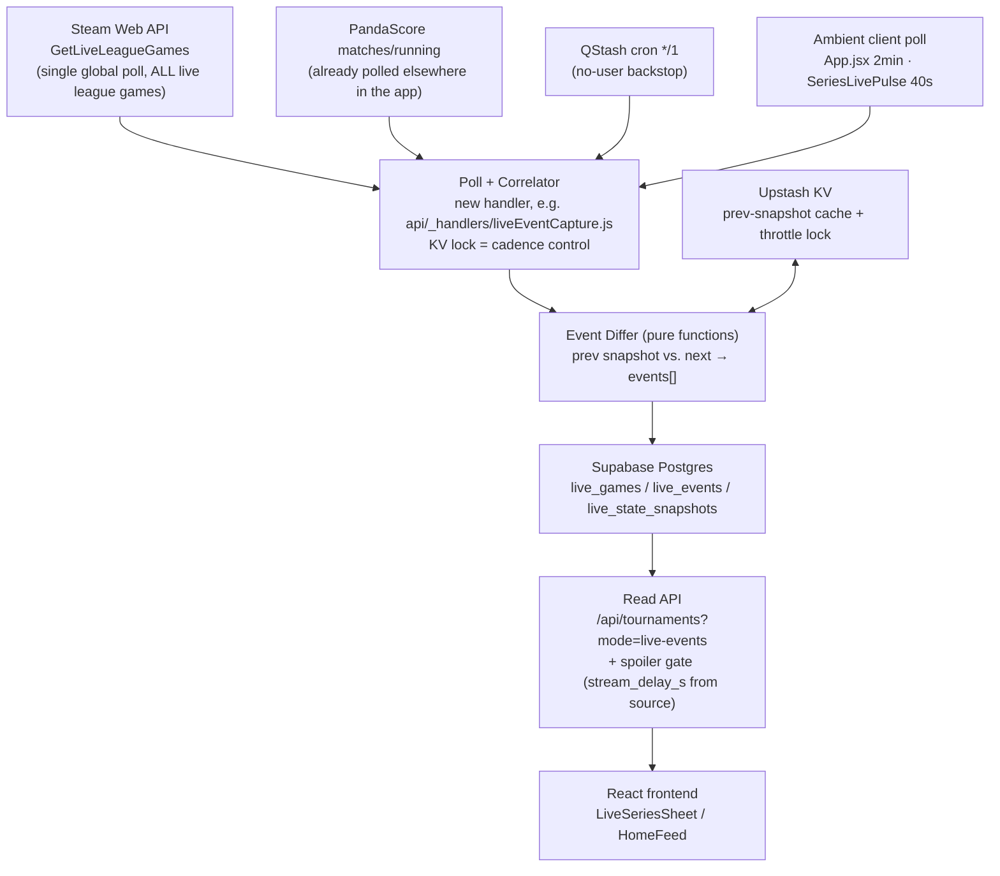
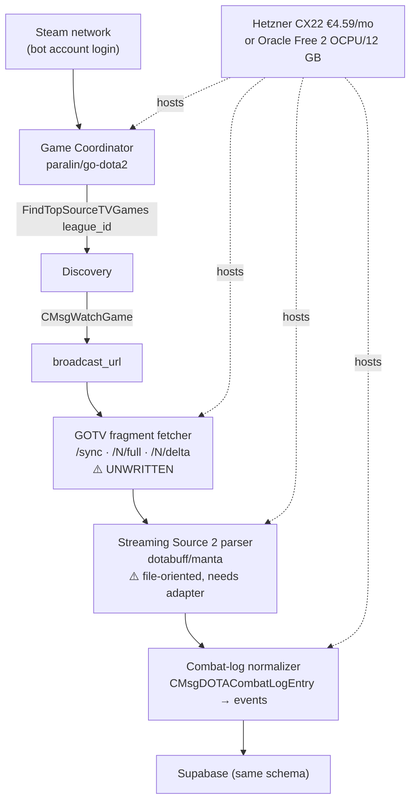

# Own Live Event Ingestion — Technical Investigation

**Date:** 2026-08-04 (investigation), **validated 2026-08-05 against real live matches**
**Status:** Core mechanism empirically validated. Data source corrected from the original plan (see 2026-08-05 update below). No pipeline code written yet.
**Scope:** Can Spectate Esports build its own Dota 2 live event pipeline at ~$0/month instead of paying commercial providers?

---

## 2026-08-05 Validation Update — read this first

The original recommendation (below) was built around `GetRealtimeStats` + a `server_steam_id` sourced from OpenDota's `/api/live`. **That specific mechanism does not work** — empirically confirmed against 5+ live matches, `GetRealtimeStats` returns an identical, empty HTTP 400 for both a real OD-sourced `server_steam_id` and a garbage one, while the same key works fine on other Steam endpoints. The blocker isn't auth or ToS — it's discovery: `GetRealtimeStats` only serves IDs present in Valve's own internally-curated live pool (`GetTopLiveGame`), and that pool only ever contained pubs when tested (0 league games across 160 checked slots), because no currently-live league game has enough in-client DotaTV viewership to rank in it.

**The good news is better than the original plan.** `IDOTA2Match_570/GetLiveLeagueGames/v1` — a *different* endpoint, tested and dismissed too quickly in the original pass below — turns out to carry a full `scoreboard` object per game: per-player kills/deaths/assists/last-hits/denies/gold/level/GPM/XPM/items(×6)/position(x,y)/net-worth/ability-levels, team-level `tower_state`/`barracks_state` bitmasks, and a direct `roshan_respawn_timer`. It was present on 39 of 40 live league games checked, **independent of spectator count** (present even at 0 spectators) — so it isn't gated the way `GetRealtimeStats` is. No `server_steam_id`, no `GetTopLiveGame`, no OpenDota dependency needed at all.

Validated live against a real match (`Yakult Brothers vs PlayTime`, *Games of the Future 2026*): team names matched PandaScore byte-for-byte; two polls ~30s apart showed real score/kill/item/level deltas; `stream_delay_s: 120` was returned directly per-game (no manual stream cross-referencing needed). Raw snapshots saved as fixtures at `__tests__/fixtures/get-live-league-games/`.

**Net effect on the recommendation below:** the Tier 1 conclusion (build it, $0/mo, sanctioned API, no GC/bot-account risk) stands and is *strengthened* — the pipeline is simpler than originally designed (a single global poll of one endpoint, not a per-game `server_steam_id` lookup chain). Every reference to `GetRealtimeStats`/`server_steam_id`/`live_game_map` as the Tier 1 mechanism below is superseded by `GetLiveLeagueGames`. Sections are annotated inline; the full original text is kept for its still-valid reasoning (risk analysis, cost model, event catalogue, spoiler handling) with corrections noted in place rather than deleted, so the record of what was actually tried is preserved.

One real limitation this surfaced: `GetLiveLeagueGames`' items are `item0`–`item5` only (6 slots) — no backpack (6-8) or neutral item slot. Noted in §6.4.

---

## 0. Two corrections to the brief, up front

**(a) The stack is Vite + React, not Next.js.** `package.json` has `vite@7`, `react@19`, no `next`. The API layer is Vercel serverless functions under `/api/*` (plain `(req, res)` handlers), not Next.js API Routes. This doesn't change the architecture below — the ingestion worker is external to Vercel either way — but it matters for anyone reading the brief later.

**(b) "Replace PandaScore" and "build a live event pipeline" are two different projects.** This is the most important finding in the document, so it goes first.

I enumerated every PandaScore call site in the repo (33 files). Every single one is **schedule, structure, or identity** data:

| What PandaScore is used for today | Endpoints |
|---|---|
| Tournament/league discovery, tiers, brackets, standings | `/tournaments/{running,upcoming,past}`, `/series/*` |
| Match schedule (`scheduled_at`, `begin_at`) | `/matches/upcoming`, `/matches/running`, `/matches/past` |
| Series structure — Bo1/Bo3/Bo5, per-game results, series score | `match.games[]`, `number_of_games` |
| Team identity, slugs, acronyms, logos | `/teams` |
| **Official Twitch stream URLs** (the VOD system's anchor) | `match.streams_list` — **LOCKED subsystem** |

PandaScore supplies **zero in-game telemetry**. Not one kill, item, or tower. The live telemetry the app already shows — gold lead, kill score, live draft, hero picks, building state — comes from **OpenDota `/api/live`**, free, no key ([api/_handlers/liveOdCapture.js](api/_handlers/liveOdCapture.js#L45)).

So:

- **Replacing PandaScore** = replacing a schedule/metadata/streams backbone. Game Coordinator, GOTV, and replay parsers give you **none of that**. The realistic replacement is Liquipedia + Valve's league APIs, and it is a *harder, lower-value* project than it sounds (§9.1).
- **Building live event ingestion** (`HeroKilled`, `RoshanKilled`, `TowerDestroyed`, …) = a **net-new capability** that PandaScore never sold you. This is the interesting project, and it has a much cheaper answer than the brief assumes.

The rest of this document answers the brief's questions in full, but the recommendation splits along that line.

---

## 1. Executive Summary

**Is it possible?** Yes for live events — and cheaper than expected, and simpler than the first pass below concluded. Partially and unattractively for schedule data.

> **⚠️ Superseded mechanism, corrected 2026-08-05:** the original headline finding in this section pointed at `GetRealtimeStats` + a `server_steam_id` sourced from `live_game_map`. That specific chain does not work (see the validation update above). The corrected finding below replaces it. The event-model conclusion ("~80% of the requested events, $0 cost, no ToS risk") still holds — it just comes from a different, simpler endpoint.

**The corrected headline finding:** there is a **free, official, first-party Valve HTTP API** that returns nearly everything the brief asks for, requires no per-game ID lookup, and needs nothing the codebase doesn't already have (a free Steam Web API key).

`GET https://api.steampowered.com/IDOTA2Match_570/GetLiveLeagueGames/v1/?key={STEAM_API_KEY}` returns, **in one call, every currently-live league game at once** (40 in the validation run):

```
games[]: match_id, league_id, spectators, stream_delay_s, series_type,
         radiant_series_wins, dire_series_wins,
  radiant_team / dire_team: team_name, team_id, team_logo
  scoreboard:
    duration, roshan_respawn_timer,        ← direct Roshan signal, not inferred
    radiant / dire:
      score, tower_state, barracks_state,  ← separate bitmasks per team
      picks[], bans[],
      players[]: account_id, hero_id, level,
                 kills, death, assists, last_hits, denies,
                 gold, gold_per_min, xp_per_min, net_worth,
                 item0..item5,             ← 6-slot inventory (no backpack/neutral)
                 position_x, position_y,   ← live hero positions
                 ultimate_state, ultimate_cooldown,
                 abilities[]: ability_id, ability_level
```

That is hero positions, per-player KDA/CS/gold/net-worth, full ability levels, a direct Roshan timer, and separate tower/barracks bitmasks — a superset of what the original `GetRealtimeStats` plan targeted, from a single global poll instead of a per-match lookup chain. It costs a free Steam Web API key and one HTTP GET regardless of how many league games are live simultaneously.

**No `server_steam_id`, no `live_game_map`, no OpenDota dependency for discovery.** Correlation to a PandaScore match is a direct team-name match against `radiant_team.team_name`/`dire_team.team_name` — confirmed byte-identical against real PandaScore data in validation (§2.E).

**Therefore:** a diffing engine over `GetLiveLeagueGames` snapshots synthesizes the requested event model at **$0 marginal infrastructure cost**, with **no ToS gray area**, **no Steam bot accounts**, **no protobuf parsing**, and **no new server**. It's simpler to run than the original plan — one poll, not N.

The heavier paths (GC + GOTV broadcast + `manta`) buy you the remainder — smoke, runes, buybacks, sub-second timing — for roughly 100× the engineering and operational cost. **Do not start there.**

**Recommended path:** ship the `GetLiveLeagueGames` differ (Tier 1). Treat GC/GOTV as a *possible* Tier 3 that must be justified by a product need Tier 1 demonstrably cannot serve.

**The one thing that could kill the whole feature** is not technical: **DotaTV data runs ahead of the Twitch broadcast.** OpenDota `/api/live` reports `delay: 120` (2 min) on pubs; tournament organizers add up to 15 more minutes under Valve's DotaTV License. A live event feed built on this data will **spoil the stream your users are watching**. This must be designed for on day one (§6.6, §11) — it interacts directly with the existing Spoiler-Free Mode.

---

## 2. Data Source Investigation

### 2.A Steam Game Coordinator

**How authentication works.** You log a real Steam account into the Steam network (username/password, or a stored refresh token), call `gamesPlayed([570])` to signal you're "playing Dota 2", and the client is handed a GC session. All GC messages are protobuf over the Steam connection. There is no API key, no OAuth — it is a **full user account acting as a game client**.

**Existing libraries** (verified against the GitHub API, 2026-08-04):

| Repo | Lang | Stars | Last push | State |
|---|---|---|---|---|
| [paralin/go-dota2](https://github.com/paralin/go-dota2) | Go | 176 | **2026-08-04** | **Actively maintained.** Codegen'd from Valve's protos via `apigen`. The reference implementation. |
| [SteamRE/SteamKit](https://github.com/SteamRE/SteamKit) | C# | 3,156 | 2026-08-01 | Very active. The Steam-protocol foundation everything else copies. |
| [DoctorMcKay/node-steam-user](https://github.com/DoctorMcKay/node-steam-user) | JS | 1,108 | 2025-12-04 | Maintained. Steam session layer for Node. |
| [blastorg/gamecoordinator-dota-communicator](https://github.com/blastorg/gamecoordinator-dota-communicator) | TS | 12 | 2025-04-03 | **BLAST's own Dota GC client, open-sourced.** Thin, typed, sits on `node-steam-user`. Small but proof a Tier-1 esports company uses exactly this approach. |
| [ValvePython/dota2](https://github.com/ValvePython/dota2) | Python | 221 | 2023-03-02 | Stale (3 years). Usable as reference, not as a dependency. |
| [Arcana/node-dota2](https://github.com/Arcana/node-dota2) | JS | 552 | 2022-06-08 | **Archived.** Its own README points at `paralin/go-dota2`. Do not use. |

**Available event types / what it exposes.** From [`dota_gcmessages_client_watch.proto`](https://github.com/SteamTracking/GameTracking-Dota2/blob/master/Protobufs/dota_gcmessages_client_watch.proto):

- `CMsgClientToGCFindTopSourceTVGames` → `CMsgGCToClientFindTopSourceTVGamesResponse{ game_list: CSourceTVGameSmall[] }`. **Accepts a `league_id` filter.** Each `CSourceTVGameSmall` is field-for-field identical to what OpenDota `/api/live` returns — because that's exactly where OpenDota gets it. You would be reimplementing OpenDota's retriever.
- `CMsgWatchGame{ server_steamid, watch_server_steamid, client_version, regions }` → `CMsgWatchGameResponse{ watch_game_result, source_tv_public_addr, source_tv_port, watch_tv_unique_secret_code, broadcast_url }`. **`broadcast_url` is the gateway to the live GOTV stream** (§2.B).
- `CMsgClientToGCTopLeagueMatchesRequest`, `CMsgDOTASeries` (series structure + live game!), `CDOTABroadcasterInfo`, `CMsgClientToGCMatchesMinimalRequest`.

**Can it receive live updates?** Only by polling `FindTopSourceTVGames`. The GC does not push per-game telemetry. It is a **discovery and handshake layer**, not a telemetry feed.

**Hero positions?** No. **Inventories?** No. `CSourceTVGameSmall.players[]` is `{account_id, hero_id, team_slot, team}` — that's it. Positions and items require the GOTV stream (§2.B) or `GetRealtimeStats` (§2.E).

**Multiple matches?** Yes for discovery — one response carries up to ~100 games. But `CMsgWatchGame` is a per-game handshake, and `CMsgCancelWatchGame` exists, implying the client is expected to watch one at a time. N concurrent matches likely needs **N Steam accounts**, or at least careful sequencing.

**Production-ready?** The libraries are. The *approach* carries account risk (§10) and requires you to run and babysit logged-in Steam sessions.

**Blocking constraint found:** `CMsgWatchGameResponse.WatchGameResult` includes `MISSINGLEAGUESUBSCRIPTION`. Ticketed leagues require the bot account to own the league ticket. TI and most majors are free-to-spectate, but this is a per-event unknown, not a solved problem.

---

### 2.B SourceTV / GOTV

**Can pro matches be consumed live?** Yes, in principle. `CMsgWatchGameResponse.broadcast_url` is a Source 2 HTTP broadcast endpoint — the same mechanism CS2's `tv_broadcast` uses, documented on the [Valve wiki for CS:GO Broadcast](https://developer.valvesoftware.com/wiki/Counter-Strike:_Global_Offensive_Broadcast). The shape is `/sync` → current fragment number, then `/{n}/full` (keyframe) and `/{n}/delta` (incremental), ~3s per fragment.

**How the stream is obtained.** GC login → `FindTopSourceTVGames` (filter by `league_id`) → `CMsgWatchGame(server_steamid)` → poll `broadcast_url`. There is **no way to get `broadcast_url` without a GC session** — the Steam Web API does not expose it. This is why GOTV and GC are one project, not two.

**Can events be parsed before the match finishes?** Yes. Fragments carry `CDemoPacket`-class data — the same protobuf envelope as a `.dem` file. A streaming parser fed fragments in order produces live entity state and `CMsgDOTACombatLogEntry` events (kills, denies, purchases, Roshan, buybacks, runes, ability use). This is the **only** source in this document with true full-fidelity event data.

**Existing parsers.** See §2.D. All of them are written for a seekable `.dem` file, not a fragment stream. Adapting one to consume `/full` + `/delta` is real work and **nobody has published it for Dota 2**.

**Limitations — and this is the decisive one.** I searched GitHub code and the web specifically for a working Dota 2 live-broadcast consumer:

- `gh api search/code` for `dota broadcast_url WatchGame` → 20 hits, **every one is a copy of the `.proto` file**. Zero implementations.
- The only working `tv_broadcast` implementations ([FlowingSPDG/gotv-plus-go](https://github.com/FlowingSPDG/gotv-plus-go), [FIVESCUP/csgo-broadcast](https://github.com/FIVESCUP/csgo-broadcast)) are **CS:GO/CS2 relay servers**, not Dota consumers.

**You would be the first public implementation.** That is a research project with an unknown completion date, not an engineering task with an estimate.

Other limits: fragments are gone once the broadcast ends (no backfill); one `broadcast_url` per game; the broadcast carries the tournament delay baked in; the demo format changes with major patches.

---

### 2.C Running spectator clients

**Can a headless Dota client run on Linux?** Technically yes, practically no for this purpose. Dota 2 is Source 2 and requires a Vulkan device. You can force it under `Xvfb` + `llvmpipe` (software rasterization), which is what ML research harnesses like [TimZaman/dotaservice](https://github.com/TimZaman/dotaservice) (130★, last push 2024-02-18, **stale**) do. There is no `-headless`/`-textmode` equivalent for the Dota client.

**Resources per client (software rendering, realistic):**

| | Per spectator client |
|---|---|
| CPU | 1.0–2.0 cores sustained (llvmpipe rasterizes every frame) |
| RAM | 2.5–4 GB |
| GPU | None *required*, but without one CPU cost roughly triples |
| Startup | 30–90s (launch → GC → connect → spectate) |
| Disk | ~50 GB game install, plus per-instance prefix |

**Max simultaneous matches on free-tier hardware:** Oracle Always Free is now **2 OCPU / 12 GB** (halved 2026-06-15, see §3). That is **one** spectator client, maybe. On a Hetzner CX22 (2 vCPU / 4 GB, €4.59/mo): **zero** — it can't even hold one.

**Stability:** poor. Game updates force client updates; a mid-tournament Valve patch breaks every running client until you re-download and restart. Crashes are common under llvmpipe.

**Existing projects:** `dotaservice` (stale), `Nostrademous/Dota2-FullOverwrite` (2017, bot scripting, irrelevant). Nothing maintained, nothing production.

**Verdict: rejected.** Highest cost, highest ToS risk (automating the game client), worst stability, and it produces the *same* data as the GOTV path at ~30× the resource cost. There is no scenario where this is the right answer.

---

### 2.D Open-source parsers

Verified against the GitHub API on 2026-08-04:

| Repo | Lang | ★ | Last push | Verdict |
|---|---|---|---|---|
| [dotabuff/manta](https://github.com/dotabuff/manta) | Go | 684 | 2026-07-01 | **Best choice.** Source 2 parser, Dotabuff-maintained, event-callback API, ships current Dota protos. Go = single static binary, ideal for a tiny VPS. |
| [skadistats/clarity](https://github.com/skadistats/clarity) | Java | 756 | 2026-07-22 | Fastest (2–5× smoke). Active. JVM RAM/ops overhead is a real cost at this budget. |
| [odota/parser](https://github.com/odota/parser) | Java | 159 | 2026-08-01 | **Very active.** Clarity wrapper that already emits OpenDota's event schema — closest thing to a reference event model. |
| [Rupas1k/source2-demo](https://github.com/Rupas1k/source2-demo) | Rust | 64 | 2026-07-07 | Active, clean observer API. Smaller community; fewer people to ask when a patch breaks it. |
| [timkurvers/redota](https://github.com/timkurvers/redota) | JS | 91 | 2026-07-31 | Active. Browser replay *viewer*. Useful to read for wire-format understanding, not as a backend dep. |
| [dotabuff/d2vpkr](https://github.com/dotabuff/d2vpkr) | Go | 183 | 2026-08-03 | Not a parser — VPK/game-data extraction. Useful for item/ability id maps. |
| [odota/rapier](https://github.com/odota/rapier) | JS | 44 | 2017-10-21 | **Dead.** |
| [skadistats/smoke](https://github.com/skadistats/smoke) | Python | 205 | 2015-03-28 | **Archived.** |
| [ValvePython/dota2](https://github.com/ValvePython/dota2) | Python | 221 | 2023-03-02 | Stale. |

**Language preference ranking for this project:** Go (`manta`) > Rust (`source2-demo`) > Java (`clarity`/`odota-parser`) > Python (nothing maintained) > TypeScript (nothing maintained).

**Critical caveat:** every one of these parses a **complete `.dem` file**. None consume a live fragment stream. That adapter is the unwritten piece (§2.B).

---

### 2.E Steam Web API — the path the brief didn't consider (empirically validated 2026-08-05)

Three free, official, first-party endpoints tested with a real key against real live matches. Only one needs to be used.

**`IDOTA2MatchStats_570/GetRealtimeStats/v1` — validated, but the wrong tool for this job.** The endpoint itself works exactly as documented (schema confirmed against [ybabts/steamy](https://github.com/ybabts/steamy/blob/main/src/Dota2/api/getRealtimeStats.ts), [HouPoc/DOTA2_VisLive](https://github.com/HouPoc/DOTA2_VisLive/blob/master/doc/API.md), and a working call — full player telemetry returned, positions/items/abilities all present). But it only serves `server_steam_id`s present in Valve's own internally-curated live pool, exposed via `GetTopLiveGame`. Empirically:

- A `server_steam_id` sourced from OpenDota's `/api/live` and a **garbage** `server_steam_id=1` produced **byte-identical** empty HTTP 400 responses. The same key returned 200 with real data on `GetMatchHistory` and `GetLiveLeagueGames` — ruling out an auth problem.
- A `server_steam_id` sourced from `GetTopLiveGame` worked immediately, including at as few as 4 spectators — ruling out a spectator-count threshold. The differentiator is purely *which endpoint discovered the ID*, not popularity.
- `GetTopLiveGame` (tested across all 4 `partner` values, paginated to 40 slots each — 160 total) returned **zero league games**, only pubs. Its `league_id` query param is silently ignored (echoed back as 0, no filtering effect). Every currently-live league game had 0-1 spectators at test time — not enough to rank in Valve's global top-live pool.

**Conclusion: `GetRealtimeStats` is real and unblocked (no GC handshake required, contrary to an early theory formed mid-investigation from a stale practitioner report), but it's structurally the wrong fit for tier-1 league games specifically** — it only reliably serves whatever's drawing the most in-client DotaTV viewers globally, which off-tournament is always pubs. It may work for a genuinely marquee broadcast (TI, a major) with real in-client spectator numbers, but that's unverified and was not the endpoint that actually solved the problem.

**`IDOTA2Match_570/GetLiveLeagueGames/v1` — the actual answer.** Initially dismissed (correctly, for the `server_steam_id` question — it has none) but under-inspected: a first pass explicitly excluded the `scoreboard` field from its own debug output and missed that it's carrying the entire event model already. Re-tested 2026-08-05 against a real live match:

```
GET https://api.steampowered.com/IDOTA2Match_570/GetLiveLeagueGames/v1/?key={STEAM_API_KEY}
```

- Returns **all live league games in one call** — 40 at test time, no pagination needed for realistic tier-1 concurrency.
- `scoreboard` was present on **39 of 40** games, independent of spectator count (present even at 0 spectators; the 1 miss looked like a between-games timing gap, not a gating rule).
- Matched against PandaScore's `matches/running` for a real live match (`Yakult Brothers vs PlayTime`, *Games of the Future 2026*): `radiant_team.team_name`/`dire_team.team_name` matched PandaScore's opponent names **byte-for-byte**. No fuzzy matching needed for this join.
- Re-polled ~30s later and diffed: `scoreboard.duration` advanced correctly (1263s→1344s), `radiant.score`/`dire.score` changed (10→12, 7→10), and **per-player kills/deaths/items/levels changed exactly as expected** — e.g. hero_id 86 picked up a new item into slot 0, hero_id 112 into slot 2, five heroes leveled up. Real, live, diffable data. Raw snapshots saved at `__tests__/fixtures/get-live-league-games/`.
- `stream_delay_s: 120` returned **directly per-game** in the same response — this answers what the original plan called Experiment E2 (broadcast delay) for free, no manual Twitch cross-referencing required. (Other games in the same poll showed `stream_delay_s: 900` for lower-visibility leagues — organizers clearly do set this per-tournament, confirming the DotaTV License's "up to 15 minutes" language is a real, variable knob, not just an upper bound nobody uses.)
- `roshan_respawn_timer` is a **direct field**, not something to infer from an aegis-item appearing in an inventory. This is strictly better than the original plan's aegis-inference approach — Roshan can now be `exact` confidence, not `inferred`.
- **Real limitation found:** items are `item0`–`item5` only — a 6-slot schema with no backpack (slots 6-8) or neutral item slot. `ItemPurchased` events for anything routed to a backpack/neutral slot won't be visible. Noted in §6.4.

**`IDOTA2Match_570/GetTopLiveGame/v1`** — useful only as a diagnostic (it's what proved the `GetRealtimeStats` gating theory); not needed in the final Tier 1 design.

**Hard limit:** the [Steam Web API Terms of Use](https://steamcommunity.com/dev/apiterms) cap usage at **100,000 calls per day per key**. With `GetLiveLeagueGames` being a single global poll rather than one call per match, this constraint becomes trivially easy to stay under regardless of concurrency (§4.1).

---

## 3. Infrastructure

Design principle: **Vercel keeps serving only frontend + API. Supabase stays the only datastore. Ingestion is a single stateless worker.**

| Option | Spec | Cost/mo | Verdict for this project |
|---|---|---|---|
| **Vercel functions + QStash** (existing) | serverless | **$0** | ✅ **Sufficient for Tier 1.** Already how `od-live-capture` runs. Zero new infra. |
| **Oracle Cloud Always Free** | 2 OCPU ARM / 12 GB / 200 GB / 10 TB egress | **$0** | ⚠️ **Halved from 4/24 on 2026-06-15** ([InfoQ](https://www.infoq.com/news/2026/07/oracle-cloud-free-tier-limits/)). Chronic "Out of Capacity" in popular regions. Best free option for Tier 2/3, but not dependable. |
| **Hetzner CX22** | 2 vCPU / 4 GB / 40 GB / 20 TB | **€4.59** (~$5) | ✅ **Best paid option.** Fits the <$10 budget. Reliable, EU-based (low latency to most tournament GOTV relays). |
| **Fly.io** | 256 MB shared-cpu-1x | ~$2 floor, $8–25 real | ❌ Free tier removed. Per-second billing + egress makes cost unpredictable. |
| **Railway** | usage-based | $5 credit then metered | ❌ No flat tier. A always-on long-poll worker bills badly. |
| **Render** | free tier / 512 MB | $0 (sleeps) / $7 | ❌ **Free tier sleeps after 15 min idle.** Fatal for a continuous ingestion worker. |
| **DigitalOcean** | 1 vCPU / 1 GB | $6 | ⚠️ Works, strictly worse specs than Hetzner at higher price. |
| **GitHub Actions** | 2000 min/mo | $0 | ❌ **Already proven unreliable here** — memory: crons fire every 1.5–4h regardless of declared cadence. Moved off 2026-06-26. Do not revisit. |
| **Self-host (home)** | — | ~$0 + power | ❌ Residential IP, no SLA, single point of failure, you're on holiday during TI. |
| **Supabase** | 500 MB DB / 5 GB egress | **$0** → $25 Pro | ⚠️ **500 MB is the real ceiling** (§4). Free projects also pause after 7 days idle — irrelevant here given constant writes. |

**Recommendation by tier:**
- **Tier 1 (`GetLiveLeagueGames` differ — corrected 2026-08-05):** Vercel + QStash + Supabase. **$0/mo, no new infrastructure.**
- **Tier 2/3 (GC + GOTV + manta):** Hetzner CX22 at ~$5/mo. Oracle Free as a $0 alternative if you can get capacity, but assume you'll fall back to Hetzner.

---

## 4. Scalability

### 4.1 The binding constraint — corrected 2026-08-05, and now trivially satisfied

> **⚠️ Superseded math.** The table below assumed one `GetRealtimeStats` call per live match. The validated mechanism (`GetLiveLeagueGames`, §2.E) returns **every live league game in a single call**, regardless of how many are concurrently live. Call volume is now a function of *poll frequency alone*, not `frequency × concurrent_games`. The original table is kept to show the math that no longer applies.

```
calls_per_day = (seconds_in_a_day / poll_interval_seconds)
```

At a fixed 10s poll interval, running continuously: `86,400 / 10 = 8,640 calls/day` — **8.6% of the 100k cap, regardless of whether 0, 1, or 40 tier-1 games are live at once.** Even a 5s interval, run continuously 24/7, is `17,280`/day — 17% of quota. There is no realistic concurrency scenario under this design that approaches the cap; the entire adaptive-cadence mechanism the original plan required is unnecessary at Tier 1's actual usage pattern.

**Reality check on concurrency (unchanged, still relevant for *event volume*, just not for *API budget*):** tier-1 Dota peaks at ~8 concurrent games (TI group stage, four streams × two). Memory (`project_live_feed_concurrency`) measured simultaneous tier-1 live rows at just **26% of live time, 5% on ordinary events**. This still matters for §4.4's storage estimate — more concurrent games means more event rows per poll — but it no longer threatens the Steam Web API quota at all.

<details><summary>Original (superseded) per-game-call table, kept for the record</summary>

```
calls_per_game = game_duration_seconds / poll_interval_seconds
```

A 40-minute game at 5s = 480 calls. At 10s = 240.

| Concurrent live games | Poll interval | Calls/day (8h active window) | Under 100k? |
|---|---|---|---|
| 1 | 5s | 5,760 | ✅ 6% |
| 5 | 5s | 28,800 | ✅ 29% |
| 20 | 5s | 115,200 | ❌ 115% |
| 20 | 10s | 57,600 | ✅ 58% |
| 50 | 10s | 144,000 | ❌ 144% |
| 50 | 20s | 72,000 | ✅ 72% |

This table assumed a per-match `GetRealtimeStats` lookup and drove the "adaptive cadence is mandatory" conclusion. It doesn't apply to the validated single-poll design.

</details>

### 4.2 Resource envelope — Tier 1 (`GetLiveLeagueGames` differ, corrected 2026-08-05)

One response now carries **every** live league game (validated: ~400 KB for 40 games with full scoreboards, i.e. ~10 KB/game — measured directly from the saved fixtures). Network cost scales with total live-game count, not with poll count × game count as the original per-match design implied.

| | quiet day (~5 live) | tier-1 event (~15 live) | TI peak (~40 live) |
|---|---|---|---|
| CPU | negligible — JSON diff | negligible | negligible |
| RAM | ~1 MB (single prev-poll snapshot cache) | ~5 MB | ~15 MB |
| Network in (10s poll) | ~3 MB/min | ~9 MB/min | ~24 MB/min |
| Storage | see §4.4 | | |

Fits inside a Vercel serverless function's default limits with enormous headroom — this is now a *smaller* footprint than the original per-match design, since one fetch replaces N.

### 4.3 Resource envelope — Tier 3 (GOTV + manta), for comparison

| | 1 game | 5 games | 20 games | 50 games |
|---|---|---|---|---|
| CPU | 0.1–0.3 core | 0.5–1.5 | 2–6 | 5–15 |
| RAM | 150–300 MB (full entity state) | 0.8–1.5 GB | 3–6 GB | 8–15 GB |
| Bandwidth | ~25 KB/s | 125 KB/s | 500 KB/s (~1.8 GB/h) | 1.2 MB/s |
| Steam accounts | 1 | likely 5 | likely 20 | likely 50 |

**Oracle Free (2 OCPU / 12 GB) caps out around 8–12 concurrent games.** Hetzner CX22 (2 vCPU / 4 GB) caps out around **5**. The 50-game row needs a ~$40/mo machine and 50 Steam accounts — well outside budget and well inside ban risk.

### 4.4 Database writes and the Supabase ceiling

Estimated derived events per 40-minute pro game:

| Event | Count/game | Source |
|---|---|---|
| `AbilityLearned` | ~250 | `abilities[]` diff |
| `ItemPurchased` | ~150 | `items[]` diff (net of consumable churn) |
| `HeroLevelUp` | ~250 | `level` diff |
| `HeroKilled` | ~60 | `kill_count`/`death_count` diff |
| `TowerDestroyed` / `BarracksDestroyed` | ~15 | `buildings[].destroyed` transition |
| `AegisPickedUp` / `RoshanKilled` | ~8 | aegis item id in `items[]` |
| `NetWorthSnapshot` (downsampled 30s) | ~80 | throttled |
| **Total** | **~800 rows** | |

At ~120 bytes/row plus indexes → **~200 KB/game**.

| Scenario | Games/day | Storage/day | Storage/month |
|---|---|---|---|
| Tier-1 only, event days | 20 | 4 MB | ~60 MB (15 event days) |
| All league games, every day | 60 | 12 MB | **360 MB** |

**Supabase free tier is 500 MB total, and `live_game_map` / `live_game_gold` / `match_stream_history` already occupy some of it.** Ingesting every league game fills the free tier in ~6 weeks.

**Mitigations, in order of preference:**
1. **Tier-1 filter at ingest.** Only ingest games matching a tier-1 PandaScore/OpenDota league. This is already the site's operating rule and cuts volume ~4×.
2. **90-day retention** via `pg_cron` (`DELETE FROM live_events WHERE ts < now() - interval '90 days'`). Or 30 days if space gets tight.
3. **Don't store raw snapshots.** Store *derived events* + a downsampled net-worth series. Storing every 5s snapshot × 10 players would be ~5,400 rows/game and blows the budget immediately.
4. Supabase Pro ($25/mo) is the escape hatch — but that's 5× the entire infra budget, so treat it as a failure mode, not a plan.

---

## 5. Reliability

### 5.1 How often Valve changes protocols — measured, not guessed

From the commit history of [SteamTracking/GameTracking-Dota2](https://github.com/SteamTracking/GameTracking-Dota2):

| Surface | Change rate | Risk |
|---|---|---|
| `Protobufs/` overall | **3–5 commits/month**, steady since 2024 | Medium |
| `dota_gcmessages_client_watch.proto` (the file GC/GOTV depends on) | 2025-06-13, 2025-05-22, 2025-03-21, then nothing. **3 changes in 2025, 0 so far in 2026.** | **Low** |
| Replay/demo entity format | tracks major patches; `manta` sees 1–2 commits/month | Medium |
| Steam Web API JSON (`GetLiveLeagueGames`, used by Tier 1 — corrected 2026-08-05) | **No documented breaking change in years.** Undocumented but stable, and more widely relied-upon by third-party trackers than `GetRealtimeStats`. | **Low** |

**Implication:** protocol churn is *not* the main GC/GOTV risk. The main risks are account bans and the unwritten fragment-stream adapter.

### 5.2 Failure modes and recovery

| Failure | Detection | Recovery | Tier affected |
|---|---|---|---|
| Steam Web API 403/401 | HTTP status | Alert + fail-open (feed goes stale, site keeps working) | 1 |
| Steam Web API 429 / quota exhausted | HTTP status + call counter | Effectively unreachable at Tier 1's ~9%-of-quota usage (§4.1); alert anyway as a canary for a key/account problem | 1 |
| Team-name match against PandaScore fails (name drift, alias mismatch) | no `scoreboard` correlated for a known-live PS match | Reuse `TEAM_NICKNAMES`/`canonicalTeamName` from `src/teamMatching.js` — same alias table the site already maintains, don't build a second one | 1 |
| A game vanishes from `GetLiveLeagueGames` between polls (match ended) | game_id present last poll, absent this one | Emit `GameEnded`, drop from active set | 1 |
| `scoreboard` missing for a game that's otherwise listed (~1/40 observed, likely a between-games timing gap) | null check per game | Skip that game for this tick only; retry next poll — don't drop the match | 1 |
| Supabase write fails | PostgREST error | Existing pattern: log + continue, never break the read path | 1 |
| Steam account VAC/community ban | GC login fails | Rotate to spare account. **No appeal path.** | 2/3 |
| GC session drop | heartbeat timeout | Exponential-backoff relogin (30s → 5min cap) | 2/3 |
| `MISSINGLEAGUESUBSCRIPTION` | `WatchGameResult` enum | Skip that league entirely; no workaround without buying the ticket | 2/3 |
| GOTV fragment gap | non-contiguous fragment number | Re-fetch `/{n}/full` keyframe and resync | 3 |
| Valve patch breaks `manta` | parser exception storm | Pin parser version; wait for upstream fix (historically days) | 3 |

### 5.3 Match discovery — corrected 2026-08-05, and simpler than originally planned

> **⚠️ Superseded.** The original plan reused `findOdMatchByTime()` (fuzzy time+name matching against OpenDota) because `GetRealtimeStats` needed an OD-sourced `server_steam_id`. That's no longer the mechanism.

New flow: `GetLiveLeagueGames` → for each game with a `scoreboard`, match `radiant_team.team_name`/`dire_team.team_name` against PandaScore's `matches/running` opponent names. Validated live: exact byte-for-byte match, no fuzzy logic needed for this specific join (§2.E). Still, don't hand-roll a second name-matching algorithm for the inevitable case where names don't match exactly (rebrands, aliases, romanization differences) — **reuse `TEAM_NICKNAMES`/`canonicalTeamName` from `src/teamMatching.js`**, the same alias table the site already maintains for every other PS-adjacent matching problem (`feedback_ps_od_matching`, `feedback_reuse_existing_logic`). OpenDota and `live_game_map` are no longer in this discovery path at all — this pipeline has no OpenDota dependency.

### 5.4 Required monitoring

Must be **in-app only** — Vercel is on the free plan, so Log Drains are unavailable (`project_vercel_plan`).

- Steam Web API daily call counter in KV, exposed on the existing `?mode=monitor` endpoint. Alert at 70% of 100k.
- Per-game "last successful poll" age; alert if a game is live and unpolled >60s.
- Event-emission rate sanity check: a live game emitting **zero** events for 5 minutes means the differ is broken, not that the game is quiet.
- Existing `trackError()` for all failures.

---

## 6. Data Model (Supabase / Postgres)

### 6.1 Design principles

1. **One append-only event table**, not one table per event type. Event types are open-ended; migrations per new event type would be miserable.
2. **`(od_match_id, game_time, event_type, seq)` is the natural key.** `game_time` is the in-engine clock — stable, monotonic, and what every consumer wants on an x-axis. Wall-clock `captured_at` is metadata, not identity.
3. **Idempotent by construction.** The differ re-derives events from snapshots; a duplicate poll must be a no-op. Same `ON CONFLICT DO NOTHING` pattern as `live_game_gold`.
4. **JSONB payload for event-specific fields**, typed columns only for what is queried or joined. Avoids 12 sparse column sets.
5. **Store raw, filter at read** — the convention already established across `live_game_map` and `live_game_gold`.

### 6.2 Schema

> **⚠️ `server_steam_id` corrected 2026-08-05: no longer required.** The validated mechanism (`GetLiveLeagueGames`, §2.E) doesn't need it for polling — `match_id` from that same response is the real Dota match ID (same ID space OpenDota uses), so it still works as the primary key. `server_steam_id` is now optional metadata only, kept `null`-able in case a future Tier 3 GOTV path wants it.

```sql
-- Parent: one row per live game we are ingesting.
-- FK target for events. od_match_id (= Valve's real match_id, from GetLiveLeagueGames — not
-- an OpenDota-specific concept despite the column name) is the join key used across the codebase.
create table live_games (
  od_match_id      bigint primary key,
  server_steam_id  text,                        -- TEXT: exceeds bigint. Optional now (see note above); kept for a possible future Tier 3.
  league_id        int,
  radiant_team_id  int,
  dire_team_id     int,
  radiant_name     text,
  dire_name        text,
  started_at       timestamptz not null default now(),
  ended_at         timestamptz,
  last_polled_at   timestamptz,
  last_game_time   int,                          -- resume point after a worker restart
  status           text        not null default 'live'
                     check (status in ('live','ended','abandoned'))
);
create index live_games_status_idx on live_games (status) where status = 'live';

-- Child: the event stream. Append-only.
create table live_events (
  id           bigserial   primary key,
  od_match_id  bigint      not null references live_games(od_match_id) on delete cascade,
  game_time    int         not null,             -- in-engine seconds; negative = draft/pre-horn
  event_type   text        not null,
  seq          smallint    not null default 0,   -- disambiguates same-type events in one tick
  team         smallint    check (team in (2,3)),-- Valve convention: 2=Radiant, 3=Dire
  player_slot  smallint    check (player_slot between 0 and 9),
  hero_id      int,
  target_slot  smallint    check (target_slot between 0 and 9),
  payload      jsonb       not null default '{}'::jsonb,
  captured_at  timestamptz not null default now(),
  confidence   text        not null default 'exact'
                 check (confidence in ('exact','inferred','uncertain')),

  constraint live_events_natural_key
    unique (od_match_id, game_time, event_type, player_slot, seq)
);

create index live_events_match_time_idx on live_events (od_match_id, game_time);
create index live_events_type_idx       on live_events (od_match_id, event_type);
create index live_events_recent_idx     on live_events (captured_at desc);
create index live_events_payload_gin    on live_events using gin (payload jsonb_path_ops);

-- Downsampled state timeseries. Separate from events: different write rate,
-- different read pattern, and it must not bloat the event index.
create table live_state_snapshots (
  od_match_id   bigint      not null references live_games(od_match_id) on delete cascade,
  game_time     int         not null,
  radiant_nw    int,
  dire_nw       int,
  radiant_score smallint,
  dire_score    smallint,
  radiant_towers smallint,
  dire_towers    smallint,
  captured_at   timestamptz not null default now(),
  primary key (od_match_id, game_time)
);
```

### 6.3 Event catalogue — corrected 2026-08-05

> **⚠️ Source and several confidence levels changed.** The table below is rewritten against `GetLiveLeagueGames`' validated `scoreboard` shape (§2.E), not `GetRealtimeStats`. Two upgrades worth noting up front: **`RoshanKilled` moves from `inferred` to `exact`** (direct `roshan_respawn_timer` field, no aegis-inference needed), and buildings split into two independently-diffable bitmasks (`tower_state`, `barracks_state`) instead of one combined field.

`confidence` is still a first-class column — a few of these remain genuinely derived, not observed. Never present an inferred event to a user as fact without saying so.

| `event_type` | Derivation from `GetLiveLeagueGames` `scoreboard` | `payload` | Confidence |
|---|---|---|---|
| `HeroKilled` | `death` increments on victim; `kills` increments on a killer | `{killer_slot, assist_slots[]}` | **`exact`** for the death; `inferred` for killer when >1 kill in one tick |
| `ItemPurchased` | new id appears in `players[i].item0..item5` | `{item_id, slot}` | `exact`, but see §6.4 — **6-slot schema only, no backpack/neutral slot visibility** |
| `AbilityLearned` / ability level-up | `abilities[].ability_level` increments (radiant/dire arrays are per-team, not indexed per-player — needs a player↔ability mapping pass, see §6.4) | `{ability_id, level}` | `exact` |
| `HeroLevelUp` | `players[i].level` increments | `{level}` | `exact` |
| `TowerDestroyed` | `tower_state` bitmask bit flips 1→0 (needs bit-layout decode, unlike OD's opaque combined bitmask this one is at least team-separated) | `{lane, tier}` (once decoded) | `exact` once decode is verified — **new unknown, see §12 E12** |
| `BarracksDestroyed` | `barracks_state` bitmask bit flips 1→0, same caveat | `{lane, kind}` | `exact` once decode is verified |
| `RoshanKilled` | **`roshan_respawn_timer` transitions 0 → nonzero** | `{killed_by_team}` (inferred from which team's net-worth/kill spiked in the same tick, since the field itself doesn't name a team) | **`exact`** on the kill itself — upgraded from `inferred`; team attribution still `inferred` |
| `AegisPickedUp` | no longer needed as a Roshan proxy — kept only if item-level detail is wanted | `{hero_id}` | `exact`, subject to the 6-slot item caveat |
| `NetWorthSwing` | `players[].net_worth` aggregate delta exceeds a threshold | `{delta, radiant_nw, dire_nw}` | `exact` |
| `Teamfight` | ≥3 `HeroKilled` within a 20s window | `{deaths[], net_worth_delta}` | `inferred` |
| `BuybackUsed` | `respawn_timer` unexpectedly resets to 0 with a large gold drop | `{cost_estimate}` | **`uncertain`** — do not ship without validation |
| `RunePickedUp` | ❌ **not derivable** | — | — |
| `SmokeUsed` | ❌ **not derivable** (smoke is a consumable; leaving inventory ≠ used, and it's outside the 6-slot window anyway) | — | — |
| `WardPlaced` | ❌ **not derivable** for the same reason | — | — |

The three ❌ rows still require the GOTV combat log (Tier 3). They remain the honest cost of the cheap path.

### 6.4 Known derivation hazards — corrected 2026-08-05

- **`ItemPurchased` vs. inventory movement — worse than originally scoped.** `item0..item5` is *current inventory in 6 slots*, not a purchase log, and this schema (unlike the original `GetRealtimeStats` plan) has **no visibility into the backpack (slots 6-8) or the neutral item slot at all** — an item moved to backpack looks identical to a sold item from this data alone. Mitigation unchanged in spirit: emit only on **first-ever appearance** of an item id for that player in that match, suppress the known consumable set, but set expectations lower — some real purchases into backpack/neutral will simply never be observed.
- **Ability↔player mapping needs a decode pass.** `scoreboard.radiant.abilities[]`/`scoreboard.dire.abilities[]` are **team-level arrays** (`{ability_id, ability_level}`), not nested under each player object the way items are. Determining *which* player leveled which ability requires cross-referencing hero_id → known hero ability kit (via `odota/dotaconstants`, already an implicit dependency) rather than a direct index lookup. New complexity vs. the original plan, where `abilities[]` was nested per-player.
- **`tower_state`/`barracks_state` bit layout is unverified.** Two raw bitmasks (`1982`, `1974` observed) with no documented layout in this response. Must be reverse-engineered against a real game with real tower losses and cross-checked post-game against OpenDota's `objectives[]` (`building_kill` events) before shipping `TowerDestroyed` as `exact`. This is a new, concrete unknown — tracked as **E12** in §12.
- **Kill attribution under concurrency.** One tick with two deaths and two kill increments has an ambiguous pairing. Rule: emit both `HeroKilled` events with `confidence='inferred'` and `killer_slot=null` rather than guessing. A wrong killer is worse than an unattributed kill.
- **`roshan_respawn_timer` team attribution is inferred, not given.** The field says *that* Roshan died and roughly *when* it respawns, not *which team* got it. Infer from whichever team's net-worth/kill-score moved in the same or adjacent poll tick; mark team attribution `inferred` even though the kill event itself is `exact`.
- **Stale-snapshot transients.** [liveGamePulse.js:50](api/_handlers/liveGamePulse.js#L50) already filters bogus all-zero telemetry from OD `/live` on first appearance. Assume `GetLiveLeagueGames` can show the same class of transient on a game that just appeared in the feed. Apply the same guard at write time, not read time — an event row is permanent in a way a graph point isn't.
- **`scoreboard.duration` can go backwards or freeze** on pause. Never emit an event for a `duration` ≤ the game's last-seen value unless the type genuinely allows it. The unique constraint catches the rest.

### 6.5 Indexing strategy

- `(od_match_id, game_time)` — the primary read: "give me this match's timeline."
- `(od_match_id, event_type)` — "how many towers has Radiant lost."
- `(captured_at desc)` — the cross-match "what just happened" homepage feed.
- GIN on `payload` with `jsonb_path_ops` — smaller and faster than default GIN for the containment queries this will actually run.
- **Do not** index `team`, `hero_id`, or `confidence` initially. Low cardinality, and index bloat is a direct hit on a 500 MB budget. Add them only when a real query needs one.

### 6.6 Spoiler handling belongs in the schema

Add to `live_games`:

```sql
alter table live_games add column broadcast_delay_s int not null default 120;
```

Every read path must be able to answer "would returning this event spoil the broadcast?" The client already has Spoiler-Free Mode; the API needs to serve it. Recommended rule: **never expose an event whose `game_time` is inside `broadcast_delay_s` of the newest observed `game_time` for that match**, unless the caller explicitly opts in.

---

## 7. Recommended Architecture

### 7.1 Tier 1 — recommended (no new infrastructure, corrected 2026-08-05)

> **⚠️ Simplified from the original design.** The diagram and component list below replace the original `GetRealtimeStats`/`live_game_map`/OpenDota chain with the validated single-poll mechanism. This is a genuinely simpler pipeline than first planned — one global fetch instead of a discovery-then-lookup chain, and it can be a **new, standalone poller** rather than an extension of `liveOdCapture.js`, since it has no OpenDota dependency to piggyback on.



**Component by component:**

1. **Steam Web API `GetLiveLeagueGames`** — free, single call returns every live league game's full scoreboard at once. New. Needs `STEAM_API_KEY` env var (validated working 2026-08-05). No per-match lookup, no discovery-pool gating.
2. **PandaScore `matches/running`** — already polled by the existing site for other purposes; reused here purely for team-name correlation, not for telemetry.
3. **Poll + correlator** — a new, standalone handler (no longer an extension of `liveOdCapture.js`, since there's no shared OpenDota dependency to extend). Same `LOCK_TTL_S`-style KV lock pattern as the existing capture jobs, for cadence control. At ~9% of daily quota even at continuous 10s polling (§4.1), **no adaptive cadence is needed** — a fixed interval is sufficient.
4. **Event differ** — pure functions, `(prevScoreboard, nextScoreboard) → Event[]`. No I/O. Unit-testable against the real recorded fixtures already saved at `__tests__/fixtures/get-live-league-games/`.
5. **KV snapshot cache** — previous poll's full response (all games at once), single key, short TTL. Upstash Redis, already provisioned.
6. **Supabase** — `ON CONFLICT DO NOTHING` batch insert. Failure logs and continues; never breaks the read path.
7. **Read API** — a new `?mode=` on `api/tournaments.js`, matching the existing handler convention. Applies the spoiler gate using the `stream_delay_s` value the source API returns per game, not a hardcoded default.
8. **Frontend** — feeds the existing live sheet and homepage.
9. **Triggers** — the existing dual trigger: client ambient poll (free) + QStash `*/1` backstop for no-user windows.

**Why this shape:** simpler than originally planned — steps 3-9 are the same *kind* of component the codebase already has patterns for, but the discovery/correlation chain collapsed from a 3-hop (OD `/live` → `live_game_map` → `GetRealtimeStats`) design to a 2-hop (`GetLiveLeagueGames` → team-name match) one, with no OpenDota dependency at all for this specific feature.

### 7.2 Tier 3 — the heavy path, for reference only



Same `live_events` schema downstream — which is the point. Tier 3, if it ever happens, is a **source swap behind a stable interface**, not a rewrite. Design Tier 1's normalizer boundary accordingly.

---

## 8. MVP

**The smallest thing that puts live pro match events on Spectate.**

**Ship exactly this. Nothing else.**

- **Scope:** *tier-1 live games only*, four event types: `TowerDestroyed`, `HeroKilled`, `RoshanKilled` (**direct `roshan_respawn_timer` signal, corrected 2026-08-05 — no longer aegis-inferred**), `ItemPurchased` (big items only — BKB, Blink, Aghanim's, Radiance, Rapier, Refresher, Octarine, Shiva's, subject to the 6-slot item-visibility caveat in §6.4).
- **Why these four:** `TowerDestroyed` is `exact` (pending the bit-layout decode, E12) and includes lane+tier (immediately better than OpenDota's `building_state` bitmask, which per `api/_buildingState.js` cannot even resolve barracks — this source separates tower/barracks into two bitmasks). `HeroKilled` is the most legible event to a viewer. `RoshanKilled` is the single highest-value moment in Dota, **completely absent** from OpenDota `/api/live` (`project_live_telemetry_inventory`), and now backed by a direct timer field rather than an inference. Big-item purchases are the cheapest "something is about to happen" signal.
- **Cadence:** fixed 10s. Confirmed sufficient — at ~9% of daily Steam Web API quota even run continuously (§4.1), no adaptive logic is needed at MVP scale or well beyond it.
- **UI:** one vertical event feed inside the existing `LiveSeriesSheet`, owner-gated (`?owner=1`) — the same staged-rollout pattern used for the gold graph and objectives readout.
- **Spoiler rule:** hard-suppress any event within `stream_delay_s` (returned directly per game by `GetLiveLeagueGames`, not a hardcoded guess) of the match's newest polled state. Not configurable in the MVP.
- **Infra:** none. New standalone poll handler (no `liveOdCapture.js`/OpenDota dependency — see §7.1).

**Explicitly NOT in the MVP:** hero position rendering, teamfight detection, buyback inference, ability tracking, level-up tracking, net-worth swing events, cross-match feeds, push notifications, adaptive cadence, GC, GOTV, replay parsing, any new server.

**Definition of done:** during one real tier-1 series, the feed shows correct towers, kills, and Roshan, with zero false positives, and the site's existing behavior is unchanged if the feed fails.

**Effort:** ~2 days for the differ + schema + endpoint, ~1 day for the UI, plus one live tournament for validation. Compare to Tier 3: weeks of research with no guarantee of success.

---

## 9. Cost Analysis

### 9.1 Infrastructure

| | MVP | 100 DAU | 1,000 DAU | 10,000 DAU |
|---|---|---|---|---|
| Vercel (frontend + API) | $0 | $0 | $0 | **$20** (Pro — bandwidth/invocations) |
| Supabase | $0 | $0 | $0–25 | **$25** (Pro — 500 MB will be exceeded) |
| Upstash Redis | $0 | $0 | $0 | $0–10 |
| Steam Web API | **$0** | $0 | $0 | $0 (server-side; DAU-independent) |
| OpenDota | $0 | $0 | $0 | $0 |
| QStash | $0 | $0 | $0 | $0–5 |
| Ingestion compute | **$0** (Tier 1) | $0 | $0 | $0 |
| **Tier 1 total** | **$0** | **$0** | **$0–25** | **~$50–60** |
| *Tier 3 add-on (Hetzner)* | *+$5* | *+$5* | *+$5* | *+$5* |

**Key property: ingestion cost is independent of DAU.** Polling load is driven by concurrent *matches*, not users. Read load scales with DAU and is absorbed by the existing KV cache layer. This is a genuinely favorable scaling shape.

**The real cost driver at scale is Supabase storage, not compute.** §4.4 shows the free 500 MB filling in ~6 weeks without a retention policy. **Ship the retention policy with the MVP, not after.**

### 9.2 AI costs (separate, as requested)

Current pricing (Anthropic first-party API):

| Model | Input $/MTok | Output $/MTok |
|---|---|---|
| Claude Haiku 4.5 (`claude-haiku-4-5`) | $1.00 | $5.00 |
| Claude Sonnet 5 (`claude-sonnet-5`) | $3.00 ($2.00 intro through 2026-08-31) | $15.00 ($10.00 intro) |

Discounts that apply: **cache reads ~0.1×** base input, cache writes 1.25× (5-min TTL) / 2× (1-hour); **Message Batches API = 50% off** all tokens. Batching is a natural fit for post-game narration; caching is a natural fit for a stable system prompt across many matches.

Live event narration is the obvious AI use case ("Roshan down, Team X takes aegis at 24:15"). Estimate at Haiku 4.5, ~800 input / ~120 output tokens per narration, ~40 narrations per game:

| | Games/mo | Cost/mo (no discounts) | With caching + batch |
|---|---|---|---|
| MVP (owner-only, no AI) | — | **$0** | $0 |
| Tier-1 events only | 300 | ~$0.30 | ~$0.10 |
| All league games | 1,800 | ~$1.80 | ~$0.60 |

**AI is a rounding error here.** The existing `/api/summarize.js` Haiku spend already dwarfs it. Do not let AI-cost concerns influence the ingestion architecture.

### 9.3 What replacing PandaScore would actually cost

For completeness, since it's the brief's framing. PandaScore's role is schedule + series structure + tournament metadata + **official stream URLs**.

- **Schedule/tournaments/brackets:** Liquipedia. But its [API Terms of Use](https://liquipedia.net/api-terms-of-use) restrict free LPDB access to "educational purposes, non-commercial public websites that do not monetize" — Enterprise otherwise. Spectate runs GA4, Vercel Analytics, and an editorial pipeline; whether that constitutes monetization is a call to make deliberately, not by default. Rate limit: 1 req/2s, 1 `action=parse`/30s. Attribution (CC-BY-SA 3.0) and a contact-bearing User-Agent are mandatory.
- **Series structure (Bo3/Bo5):** `CMsgDOTASeries` via GC gives `series_type` and per-game results. Requires the GC path.
- **Official stream URLs:** **no free replacement exists.** `CDOTABroadcasterInfo` gives broadcaster account ids, not Twitch channels. This alone means PandaScore cannot be fully removed without breaking the **LOCKED VOD Replay System**.

**Verdict: do not attempt to replace PandaScore.** The cost is a large rewrite across 33 files, a licensing question, a strictly worse data quality position, and a direct threat to the locked VOD subsystem — in exchange for saving a subscription that is buying something the alternatives don't sell.

---

## 10. Risks

| # | Risk | Level | Detail & mitigation |
|---|---|---|---|
| **T1** | `GetLiveLeagueGames` is undocumented (corrected 2026-08-05 — was `GetRealtimeStats`) and can be changed or removed by Valve without notice | **Medium** | No documented breaking change in years, but no SLA either. This endpoint is more established/widely used by third-party trackers than `GetRealtimeStats` was, which if anything lowers this risk vs. the original assessment. Mitigation: fail open (feed disappears, site unaffected); keep the OD `/live` pulse as the always-available floor for score/draft. |
| **T2** | 100k/day Steam Web API cap | **Very Low** (downgraded 2026-08-05) | Single global poll means real operating point is **~9% of quota at a continuous 10s interval**, regardless of concurrency (§4.1) — no adaptive cadence needed. |
| **T3** | Derived events are wrong (kill attribution, item churn, buyback, and now also tower/barracks bitmask decode) | **Medium** | Directly damages trust — a wrong "Roshan down" is worse than no feed (though Roshan itself is now `exact`, not inferred — see T3 note below). Mitigation: `confidence` column; never ship `uncertain` events; validate against post-game OpenDota parsed data before going public. New sub-risk from the corrected source: `tower_state`/`barracks_state` bit layout is unverified (E12) — don't ship `TowerDestroyed` as `exact` until decoded and cross-checked. |
| **T4** | Supabase 500 MB exhausted | **Medium** | Mitigation: tier-1 filter + 90-day retention + no raw snapshots. Ship all three with the MVP. |
| **T5** | Broadcast delay unknown/variable per event | **Resolved 2026-08-05** | `stream_delay_s` is returned directly, per game, by `GetLiveLeagueGames` itself — no manual measurement needed, and it visibly varies per tournament in practice (observed both 120s and 900s in the same poll). |
| **T6** | GOTV live fragment adapter does not exist publicly | **High** | Applies to Tier 3 only. **This is the single strongest argument for not starting there.** |
| **T7** | Steam account ban (GC/GOTV path) | **High** | Applies to Tier 2/3 only. Automation is prohibited under the Steam Subscriber Agreement (§L1). No appeal. Mitigation: don't take this path; if you must, use a dedicated throwaway account with no library/inventory value. |
| **T8** | Ticketed league gating (`MISSINGLEAGUESUBSCRIPTION`) | **Medium** | Tier 2/3 only. No technical workaround. |
| **T9** | Valve protocol change breaks parsing | **Low–Medium** | Watch proto changed 3× in 2025, 0× in 2026. Web API JSON more stable still. Mitigation: pin `manta`; monitor `SteamTracking/GameTracking-Dota2`. |
| **L1** | **Steam Subscriber Agreement prohibits automation** | **High (Tier 2/3) / Low (Tier 1)** | The SSA bars "scripts, bots, macros, or other non-human-controlled systems" interacting with Steam. A bot account logging into the GC is squarely within that. **The Steam Web API is a separate, explicitly-sanctioned surface** with its own [Terms of Use](https://steamcommunity.com/dev/apiterms) — Tier 1 is on the right side of this line, Tier 2/3 is not. |
| **L2** | Steam Web API ToU obligations | **Low** | Must: stay under 100k/day; display Valve branding/links; **must not** apply `nofollow` to Valve links or discourage crawlers from following them; maintain a privacy policy; not imply Valve endorsement. All easily satisfiable — but the `nofollow` clause is an easy accidental violation, check the footer. |
| **L3** | DotaTV License | **Low–Medium** | The [DotaTV License](https://www.dota2.com/dotatv) is free and permissive but governs *streams*, and requires compliance with organizer requirements including delays "of up to 15 minutes." It reads as being about video, not data — but a real-time data feed derived from DotaTV during a commercial tournament is close enough to the spirit that a tournament organizer could object. Mitigation: honor the delay (which §6.6 does anyway for spoiler reasons), don't monetize the feed directly, and be prepared to respond to an organizer request. |
| **L4** | Liquipedia LPDB is non-commercial-only | **Medium** | Only relevant if you attempt the PandaScore replacement (§9.3). A reason not to. |
| **M1** | Ongoing maintenance burden | **Low (T1) / High (T3)** | Tier 1: a JSON differ. Tier 2/3: Steam accounts, a VPS, a parser tracking Valve patches, a GOTV adapter nobody else maintains. |
| **M2** | Bus factor | **Medium** | Tier 3 in particular would be bespoke code with no external community. Tier 1's differ is ~300 lines of pure functions with fixtures. |
| **S1** | Long-term sustainability | **Medium** | Valve has never guaranteed any of this. But: OpenDota, Dotabuff, and STRATZ have all run on these surfaces for a decade. Tier 1 depends on the *most* stable and *most* sanctioned of them. |
| **P1** | **Spoiling the broadcast** | **High** | The highest product risk in this document. A feed ahead of the stream actively harms the core viewing experience. Mitigation: §6.6 delay gate, on by default, plus integration with existing Spoiler-Free Mode. Treat "never ahead of broadcast" as a hard invariant, not a setting. |

---

## 11. Technology Comparison

> **⚠️ T1 column corrected 2026-08-05** to reflect `GetLiveLeagueGames` (validated) instead of `GetRealtimeStats` (didn't work for this use case — see §2.E). Roshan and item rows changed; concurrency limit is no longer poll-rate-bound (§4.1).

| | **T1: `GetLiveLeagueGames` differ** | **T2: GC discovery only** | **T3: GC + GOTV + manta** | **T4: Headless clients** |
|---|---|---|---|---|
| Recurring cost | **$0** | ~$5/mo | ~$5/mo | $20–40/mo |
| New infrastructure | **None** | 1 small VPS | 1 small VPS | Beefy VPS + GPU |
| Steam account needed | **No** | Yes | Yes | Yes |
| ToS posture | **Sanctioned API** | Prohibited (SSA) | Prohibited (SSA) | Prohibited (SSA) |
| Kills / deaths | ✅ (attribution sometimes inferred) | ❌ | ✅ exact + attribution | ✅ |
| Towers / barracks | ✅ exact once bit layout decoded (E12) | ❌ | ✅ | ✅ |
| Items | ⚠️ inventory diff, **6 slots only — no backpack/neutral** | ❌ | ✅ true purchase log | ✅ |
| Abilities / levels | ✅ (team-level arrays, needs hero-kit cross-reference) | ❌ | ✅ | ✅ |
| Hero positions | ✅ `position_x`,`position_y` per player | ❌ | ✅ | ✅ |
| Roshan | **✅ exact — direct `roshan_respawn_timer`** (upgraded from ⚠️ aegis-inferred) | ❌ | ✅ explicit | ✅ |
| Runes / smoke / wards | ❌ | ❌ | ✅ | ✅ |
| Buyback | ⚠️ uncertain | ❌ | ✅ | ✅ |
| Time resolution | 5–10s (poll) | n/a | **~3s fragments, sub-second events** | real-time |
| Max concurrent games | Effectively unbounded by API quota — single global poll (§4.1) | ~100 | ~5 (CX22) / ~10 (Oracle) | 1 |
| Public prior art | Several small projects, none current — validated firsthand 2026-08-05 | Solid (`go-dota2`, BLAST) | **None for Dota** | Stale, ML-only |
| Effort | **~3 days** | ~1 week | **weeks, outcome uncertain** | weeks, likely failure |
| Maintenance | Very low | Medium | High | Very high |
| **Verdict** | ✅ **Build this — mechanism empirically confirmed** | Only as a step toward T3 | ⏸️ Only if T1 proves insufficient | ❌ **Reject** |

---

## 12. Unknowns Requiring Experimentation — updated 2026-08-05

**Resolved:**

- ~~**E1 — Does the Steam Web API work for live tier-1 games?**~~ **RESOLVED, with a corrected mechanism.** `GetRealtimeStats` does not work for OD-discovered games (confirmed via 5+ live matches + a garbage-ID control test — identical empty 400 either way). `GetLiveLeagueGames` does work, unconditionally, independent of spectator count (39/40 live league games carried full scoreboards). See §2.E for the full test log.
- ~~**E2 — What is the actual delay vs. the broadcast?**~~ **RESOLVED — no measurement needed.** `stream_delay_s` is returned directly per game by `GetLiveLeagueGames` (observed both 120s and 900s live, confirming it's genuinely per-tournament, not a fixed constant).
- ~~**E7 — Aegis inference reliability?**~~ **OBSOLETE.** No longer inferring Roshan from aegis pickup — `roshan_respawn_timer` is a direct field.

**Still open, blocking before public rollout:**

**E3 — Is the derived event stream accurate?** *(blocking)*
Record snapshots for one full game via `GetLiveLeagueGames`. After it completes, pull OpenDota's parsed match data and diff: does every derived `TowerDestroyed`/`BarracksDestroyed` correspond to a real `building_kill`? Every `HeroKilled` to a real death? What is the false-positive rate on `ItemPurchased` given the 6-slot visibility limit? **Target: zero false positives on towers and kills.**

**E12 — `tower_state`/`barracks_state` bit layout** — **STRUCTURE SOLVED 2026-08-05 from the fixtures; lane NAMING still open**

The layout is **lane-major**: `bit = laneIndex*3 + tierIndex` for towers (bits 9–10 are the two tier-4s), `bit = laneIndex*2 + kind` for barracks (0=melee, 1=ranged).

Established without needing a new live match, by testing every observed bitmask against three constraints the game physically enforces — a tier-2 cannot fall while its tier-1 stands, a tier-3 cannot fall while its tier-2 stands, and barracks cannot fall while their lane's tier-3 stands:

| Hypothesis | Violations |
|---|---|
| **lane-major** (`lane*3 + tier`) | **0 / 1,314 constraints** across 146 observed states (37 games × 2 sides × 2 snapshots) |
| tier-major (`tier*3 + lane`) | 36 |

Corroborating: max `tower_state` observed is **2047** = 11 bits (9 towers + 2 tier-4); max `barracks_state` is **63** = 6 bits (3 lanes × melee/ranged). Both exact. Worked example — match `8930406789` dire, one 80s window: tower `11100100100` → `11000100100` (bit 8 clears) while rax `111111` → `001111` (bits 4,5 clear), i.e. **bot tier-3 falls and both bot barracks fall immediately after** — the exact causal order the game requires and one a wrong layout could not reproduce.

**What remains:** the invariant test is symmetric under a top/bot swap, so it proves the *structure* but cannot distinguish which lane triple is "top" from "bot", nor which tier-4 is which. That needs **one** post-game cross-check against OpenDota's `objectives[]` (`building_kill`) — a much smaller task than the original "reverse-engineer the layout."

Implemented as `decodeTowerBit()` / `decodeBarracksBit()` in [api/_liveStoryDiff.js](api/_liveStoryDiff.js), which return `laneVerified: false` until that cross-check lands. The differ itself still emits building events at `uncertain` confidence and carries only the **raw bit** in the payload, so nothing lane-named can reach a user before verification. Proof is re-derived in `__tests__/live-story-diff.test.js` so a future fixture change cannot silently invalidate it.

**E13 — Ability↔player mapping** *(new, needed for `AbilityLearned`)*
`abilities[]` are team-level arrays, not nested per-player like items. Confirm hero_id → ability-kit cross-referencing (via `odota/dotaconstants`) reliably attributes each ability-level change to the correct player, including cases with duplicate/shared ability ids across the roster (unlikely in normal drafts, but not yet verified).

**E14 — Item-diff noise floor, revised for the 6-slot limitation.**
Over one full game, how many of the 6 visible `item0..item5` transitions are real first-time acquisitions vs. slot reshuffling within those 6 slots (items can move between slots 0-5 without a new purchase)? Sets the consumable/reshuffle suppression list. (Supersedes the original E6, which assumed full 9-slot visibility.)

**E15 — Rate-limit behavior**, unchanged from the original E4 but lower-priority now given §4.1's ~9%-of-quota headroom: is 100k/day a hard daily reset, rolling window, or also a per-minute burst limit?

*Tier 3 unknowns, only if Tier 1 proves insufficient — unchanged, not affected by the 2026-08-05 findings:*

**E8** — Is a Dota `broadcast_url` fetchable with plain HTTP given only the GC handshake, and what is the exact fragment path scheme? *(No public answer exists.)*
**E9** — Can `manta` be driven from a fragment stream without a seekable file?
**E10** — Does one Steam account support multiple concurrent `CMsgWatchGame` sessions?
**E11** — Which tier-1 leagues actually return `MISSINGLEAGUESUBSCRIPTION`?

---

## 13. Repositories Worth Studying

**Read before writing any Tier 1 code:**
- [c00kie17/dota-watch](https://github.com/c00kie17/dota-watch) (2018, unmaintained but decisive) — **the repo that actually solved this.** Its `getScoreboard()` confirmed `GetRealtimeStats` is a bare stateless call (disproving an early "requires GC handshake" theory formed mid-investigation), and its `getAllLiveGames()` pointed at `GetTopLiveGame`, which in turn proved the discovery-pool gating theory. Read `handlers/match.js` and `index.js`.
- [SteamTracking/GameTracking-Dota2](https://github.com/SteamTracking/GameTracking-Dota2) — Valve's live protobuf definitions, auto-tracked. The ground truth for every field name and enum in this document.
- [ybabts/steamy](https://github.com/ybabts/steamy/blob/main/src/Dota2/api/getRealtimeStats.ts) — complete TypeScript types for the `GetRealtimeStats` response (useful for reference even though `GetLiveLeagueGames` is the endpoint actually used).
- [HouPoc/DOTA2_VisLive](https://github.com/HouPoc/DOTA2_VisLive) — a working live visualizer, useful for cross-checking field semantics.
- [odota/dotaconstants](https://github.com/odota/dotaconstants) (380★, active) — item/ability/hero id maps. **Required** to turn `item0..item5` and `abilities[]` integers into names, and to decode the ability↔player mapping (E13). Already an implicit dependency of the site.
- [odota/core](https://github.com/odota/core) — how OpenDota structures live-game handling and its event schema.
- **Real fixtures from this project's own validation run** — `__tests__/fixtures/get-live-league-games/yakult-vs-playtime-t0.json` and `-t1.json`. Two real, ~30s-apart polls of a live tier-1-adjacent match. Ground truth for building and testing the differ before any new live match is available.

**Reference for the event model:**
- [odota/parser](https://github.com/odota/parser) (159★, pushed 2026-08-01) — OpenDota's canonical Dota event schema. **Match your `event_type` names to theirs** so post-game parsed data and live derived data are directly comparable (which is exactly what E3 needs).

**Only if Tier 3 is ever pursued:**
- [paralin/go-dota2](https://github.com/paralin/go-dota2) (176★, pushed **2026-08-04**) — the GC client.
- [dotabuff/manta](https://github.com/dotabuff/manta) (684★) — the Source 2 parser.
- [blastorg/gamecoordinator-dota-communicator](https://github.com/blastorg/gamecoordinator-dota-communicator) — a commercial esports company's GC client, in TypeScript. Small but instructive.
- [FlowingSPDG/gotv-plus-go](https://github.com/FlowingSPDG/gotv-plus-go) — the only well-built `tv_broadcast` implementation anywhere. CS2, but the fragment protocol is the same engine mechanism.
- [skadistats/compendium](https://github.com/skadistats/compendium) — the demo-format bible. Chapter 1 explains `CDemoPacket`.

---

## 14. Final Recommendation — updated 2026-08-05

**Build Tier 1: a `GetLiveLeagueGames` diffing engine inside the existing serverless stack (corrected from `GetRealtimeStats` — see the validation update at the top of this document). Do not build Game Coordinator or GOTV ingestion. Do not replace PandaScore.**

**Justification:**

1. **It costs $0/month and adds zero infrastructure.** The brief's primary objective. Tier 1 is a new, small standalone poll handler using the same patterns (KV lock, QStash backstop, fail-open) already proven elsewhere in the codebase.

2. **It delivers more of what was asked for than originally planned.** Hero positions, per-player stats, ability levels, and per-tower/barracks destruction — plus a direct Roshan signal the original `GetRealtimeStats` plan could only infer. Confirmed live against real match data, not just documentation. The gaps that remain (runes, smoke, buyback, backpack-slot items) are the ones users notice least.

3. **The hard part is now actually easier than first estimated.** No `server_steam_id`, no OpenDota dependency, no discovery-pool gating problem. Correlation to PandaScore is a direct team-name match, confirmed byte-identical in testing. This is a differ and a table, genuinely simpler than the 3-hop chain originally designed.

4. **It is on the right side of the ToS line.** The Steam Web API is an explicitly sanctioned surface with published terms — and empirically, no GC handshake is required at all (an early theory formed mid-investigation, later disproven by both `dota-watch`'s source and by directly reproducing a working call). GC bot accounts remain squarely within the Steam Subscriber Agreement's automation prohibition, with no appeal path and a ban risk that arrives without warning — plausibly mid-tournament. Tier 1 needs none of that.

5. **The GOTV path has no public prior art.** A GitHub code search for a Dota live-broadcast consumer returns twenty copies of the `.proto` file and zero implementations. That is a research project of unknown duration, not an engineering task. It is the wrong first move for a solo-maintained product.

6. **PandaScore is not the thing to replace.** It sells schedule, series structure, and official stream URLs — none of which GC, GOTV, or any parser provides. The only free schedule alternative (Liquipedia LPDB) is licensed for non-commercial use, and no free source gives official Twitch stream URLs at all, which would put the **LOCKED VOD Replay System** at risk. Replacing it is a large rewrite that buys strictly worse data.

**Sequencing — updated:**

1. ~~Run E1, E2, E3~~ **E1 and E2 are done** (2026-08-05, against a real live match — `Yakult Brothers vs PlayTime`, *Games of the Future 2026*). Mechanism confirmed, delay confirmed via the source API itself.
2. **E3 (accuracy against post-game OpenDota data), E12 (bitmask decode), and E13 (ability↔player mapping) remain and now block the MVP**, not the whole recommendation — the data source itself is no longer in question, only the derivation logic built on top of it.
3. Build the differ against the real fixtures already captured (`__tests__/fixtures/get-live-league-games/`) before the next live match, so E3/E12/E13 can be validated the moment one is available rather than starting from zero.
4. Build the §8 MVP behind the owner flag. Validate through TI 2026 (starts 2026-08-13). Ship public only after E3's accuracy target holds on real data.
5. Revisit Tier 3 **only** with a specific product requirement Tier 1 provably cannot serve. "Smoke gank detection" would be such a requirement. "More events" would not.

**One thing to decide before writing code:** the spoiler policy. A live event feed that runs ahead of the Twitch stream degrades the thing the site exists to serve. §6.6's delay gate should be a hard invariant enforced at the API boundary, not a user-facing toggle — and it's now backed by a real per-tournament `stream_delay_s` value instead of a guessed constant.
